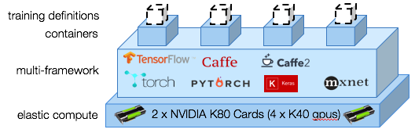

---

copyright:
  years: 2016, 2018
lastupdated: "2018-02-21"

---
{:new_window: target="_blank"}
{:shortdesc: .shortdesc}
{:screen: .screen}
{:codeblock: .codeblock}
{:pre: .pre}

# Introduction to deep learning in IBM Watson Machine Learning

**This content has moved to a [new location](https://datascience.ibm.com/docs/content/analyze-data/ml_dlaas.html). Check there for the most up-to-date information.**

Update any bookmarks you might have to the old location.

_____________

As a data scientist, you need to train hundreds of models to identify the right combination of data plus hyperparameters that optimizes the performance of your neural networks. You want to train deeper networks and explore broader hyperparameters spaces. {{site.data.keyword.pm_full}} accelerates this interative cycle by simplifying the process to train models in parallel on an elastic GPU compute cluster.
{: shortdesc}

"You want to perform more experiments…and faster."

Here's how to get started:

1. [Set up your environment for {{site.data.keyword.pm_full}}](ml_getting_access.html).

  **Note** when provisioning an instance of {{site.data.keyword.pm_full}} to use in training Deep Learning models please be sure to select the **Region** as **US South**. Deep learning functionality is not yet available in other regions, however you can still use **London** region for model deployment and scoring.

2. [Install the WML command line interface (CLI)](ml_dlaas_environment.html).
3. Learn how to configure your training run.
4. Upload training data to the cloud.
5. Start training.
6. Monitor and evaluate.

## Configure each training run

{{site.data.keyword.pm_full}} allows you to rapidly conduct deep learning iterations by submitting multiple training runs that can be queued for training. A training run consists of the following parts:

* Your neural network model defined in [supported deep learning framework](pm_service_supported_frameworks.html)
* The configuration for how to run your training, which includes the number of GPUs and location of the [object storage that contains your data set](ml_dlaas_object_store.html)

[Example training runs are provided](ml_dlaas_working_with_sample_models.html). Read through those examples to understand how working training manifests are configured then go here to [learn how to define your own training runs](ml_dlaas_working_with_new_models.html).

## Upload training data to the cloud

Before you can start training your neural networks, you first need to move your data into {{site.data.keyword.Bluemix}}. To do this, [upload your training data to an object storage service instance](ml_dlaas_object_store.html).  When you're done training, the output from your training runs is written to your object storage so that you can drag files to your desktop.

## Start training

After you create your training definitions, use the [CLI (Command Line Interface)](ml_dlaas_environment.html) to submit your training runs to {{site.data.keyword.pm_full}}. {{site.data.keyword.pm_full}} packages each of your training runs and allocates them to a Kubernetes container with the requested resources and deep learning framework.  Training runs are executed in parallel depending on the GPU resources available to your account level.  For free accounts, your are limited to 1 GPU so all additional runs are queued.

As indicated in the preceding diagram, 4 training runs are allocated to 4 containers.  Each of these containers hosts the deep learning framework required by the training run and has access to a single K40 GPU (in this instance).  All resources are allocated elastically so you are charged only from the time your training run is assigned a GPU until the training completed and output data is transferred to your Object Storage instance.

## Next Steps

* Get started using these [sample training runs](ml_dlaas_working_with_sample_models.html) or create your own [new training runs](ml_dlaas_working_with_new_models.html).
* Go in depth with the following Developer Works article: [Introducing deep learning and long-short term memory networks](https://www.ibm.com/developerworks/analytics/library/iot-deep-learning-anomaly-detection-1/index.html).

