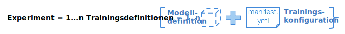

---

copyright:
  years: 2016, 2017
lastupdated: "2017-11-16"

---
{:new_window: target="_blank"}
{:shortdesc: .shortdesc}
{:screen: .screen}
{:codeblock: .codeblock}
{:pre: .pre}

# Trainingslauf erstellen

Trainingsläufe sind das Organisationsprinzip für die Durchführung von Deep-Learning-Experimenten in {{site.data.keyword.pm_full}}. Ein typisches Experiment kann aus Dutzenden bis Hunderten Trainingsläufen bestehen. Jeder Lauf wird einzeln definiert und setzt sich aus den folgenden Teilen zusammen: dem neuralen Netz, das mit einem der [unterstützten Deep-Learning-Frameworks](ml_dlaas_supported_framework.html) definiert wird, und der Konfiguration für die Vorgehensweise beim Ausführen des Trainings unter Einbeziehung der Anzahl GPUs und des Speicherorts für den Objektspeicher, der Ihren Datensatz enthält.
{: shortdesc}

<p align="center"></p>

## ZIP-Datei mit Modelldefinition erstellen

Nachdem Sie das neuronale Netz definiert und die zugehörige Datenbehandlung unter Verwendung eines der [unterstützten Deep-Learning-Frameworks](ml_dlaas_supported_framework.html) definiert haben, packen Sie diese Dateien mittels .zip-Format zusammen. Wenn das Modell beispielsweise in Torch geschrieben wurde, packen Sie Ihre .lua-Dateien; wenn es in Caffe geschrieben wurde, komprimieren Sie die .prototxt-Datei, oder wenn es in Tensorflow/Keras/MXNet geschrieben wurde, komprimieren Sie Ihre .py-Dateien.  Andere Komprimierungsformate wie z. B. 'gzip' oder 'tar' werden nicht unterstützt. Ziehen Sie die Dokumentation für das Deep-Learning-Framework zu Rate, das Sie verwenden möchten, um die Modelldefinitionsdateien vorzubereiten.  

<!-- Supposedly this isn't true anymore >> NOTE: All model definition files must be in the first level of the zip file so ensure there are no nested directories in the zip file. -->

Beispiel: Eine ZIP-Datei `tf-model.zip`, die die Modelldefinition für Tensorflow enthält, könnte die folgende Ausgabe enthalten:

```
unzip -l tf-model.zip
```
{: codeblock}

Beispielausgabe:

```
Archiv:  tf-model.zip
  Länge    Datum      Uhrzeit Name
---------  ---------- -----   ----
     7094  09-21-2017 11:38   convolutional_network.py
     5486  09-19-2017 13:49   input_data.py
---------                     -------
    12580                     2 Dateien
```
{: codeblock}

## Trainingsdaten hochladen

Ihre Trainingsdaten müssen [auf eine kompatible Object Storage-Serviceinstanz hochgeladen](ml_dlaas_object_store.html) werden. Die Berechtigungsnachweise aus dieser Object Storage-Instanz werden unten in der Manifestdatei verwendet. Der Objektspeicher wird auch zum Speichern des trainierten Modells am Ende des Trainingslaufs verwendet.

## Trainingsmanifestdatei erstellen

Das Manifest ist eine Datei im YAML-Format, die verschiedene Felder enthält, in denen das zu trainierende Modell beschrieben wird, einschließlich des zu verwendenden Deep-Learning-Frameworks, der Cloud-Objektspeicherkonfiguration, des Ressourcenbedarfs und mehrerer Argumente (einschließlich Hyperparametern), die für die Modellausführung während des Trainings und der Tests erforderlich sind. Im Folgenden werden die verschiedenen Felder der Modell-Trainingsdatei für Deep Learning beschrieben, die das Beispiel für die Tensorflow-Handschrifterkennung weiterführen.

* `model_definition.name`: Sie können einen beliebigen Wert angeben, um Ihren Trainings-Job nach seinem Start identifizieren zu können. Dieser muss jedoch nicht eindeutig sein - der Service ordnet für jeden gestarteten Trainings-Job eine eindeutige Modell-ID zu.
* `model_definition.description`: Ein weiteres Feld, in dem Sie den Job beschreiben können.
* `model_definition.author`: Optional. Geben Sie den Namen und die E-Mail-Adresse des Autors unter den Schlüsseln *Name* und *E-Mail* an.
* `model_definition.framework`: Dieses Feld enthält Framework-spezifische Informationen, die mit dem Namen und der Version eines der [unterstützten Deep-Learning-Frameworks](ml_dlaas_supported_framework.html) übereinstimmen müssen.
    - `model_definition.framework.name`: Name des Frameworks.
    - `model_definition.framework.version`: Version des Frameworks.
* `model_definition.execution`: Dieses Feld enthält Informationen über den Befehl zum Starten des Trainings.
    - `model_definition.execution.command`: Dieses Feld enthält die Hauptprogrammdatei, zusammen mit allen Argumenten, die Deep Learning ausführen muss.
    - `model_definition.execution.resource`: In diesem Feld sind die Ressourcen angegeben, die für das Training zugewiesen werden, und es sollte einen der folgenden Werte aufweisen: `Klein` (1 GPU), `Mittel` (2 GPUs), `Groß` (4 GPUs)
* `training_data_reference`: Dieser Abschnitt enthält eine Liste der Objektspeicher, aus denen die Datendateien, mit denen das Modell trainiert wird, geladen werden. Derzeit sollte diese Liste nur einen Objektspeicher enthalten, der die folgende Definition enthält:
    - `connection`: Die Verbindungsvariablen für den Datenspeicher.
    - `source.type`: Der Typ des Datenspeichers, aktuell kann dieser nur auf 's3' oder 'bluemix_objectstore' gesetzt sein. Verwenden Sie `s3`, wenn Ihre Object Storage-Instanz *Cloud Object Storage (IaaS)* ist, und `bluemix_objectstore`, wenn Ihre Object Storage-Instanz *Object Storage OpenStack Swift for Bluemix* ist.
    - `source.bucket`: Der Bucket, in dem sich die Trainingsdaten befinden.
* `training_results_reference`: In diesem Abschnitt ist der Objektspeicher angegeben, in dem die resultierenden Modelldateien und Protokolle gespeichert werden, nachdem das Training abgeschlossen ist.
    - `connection`: Die Verbindungsvariablen für den Datenspeicher. Die Liste der unterstützten Verbindungsvariablen ist vom Datenspeichertyp abhängig.
    - `target.type`: Typ des Datenspeichers, aktuell kann dieser nur auf 's3' oder 'bluemix_objectstore' gesetzt sein. Verwenden Sie `s3`, wenn Ihre Object Storage-Instanz *Cloud Object Storage (IaaS)* ist, und `bluemix_objectstore`, wenn Ihre Object Storage-Instanz *Object Storage OpenStack Swift for Bluemix* ist.
    - `target.bucket`: Der Bucket, in den die Trainingsergebnisse geschrieben werden.

Zum Beispiel kann die folgende Definitionsdatei für das Modelltraining verwendet werden, um einen Job zum Trainieren eines Tensorflow-Modells zu definieren:

```
model_definition:
  framework:
    name: tensorflow
    version: 1.2-py3
  name: tf-mnist-showtest1
  author:
    name: WML User
    email: wmluser@ibm.com
  description: Simple MNIST model implemented in TF
  execution:
    command: python3 convolutional_network.py --trainImagesFile ${DATA_DIR}/train-images-idx3-ubyte.gz
      --trainLabelsFile ${DATA_DIR}/train-labels-idx1-ubyte.gz --testImagesFile ${DATA_DIR}/t10k-images-idx3-ubyte.gz
      --testLabelsFile ${DATA_DIR}/t10k-labels-idx1-ubyte.gz --learningRate 0.001
      --trainingIters 2000000
    resource: small
training_data:
- connection:
    endpoint_url: <auth-url>
    aws_access_key_id: <username>
    aws_secret_access_key: <password>
  source:
    bucket: mnist-training-data
    type: s3
training_results:
  connection:
    endpoint_url: <auth-url>
    aws_access_key_id: <username>
    aws_secret_access_key: <password>
  target:
    bucket: mnist-training-models
    type: s3
```
{: codeblock]

Hierbei ist `convolutional_network.py` das Tensorflow-Programm (welches Teil der ZIP-Datei mit der Modelldefinition ist), das auszuführen ist. Alles andere sind Argumente für das Programm. Die Werte für Programmargumente, `--trainImagesFile train-images-idx3-ubyte.gz`, `--trainLabelsFile train-labels-idx1-ubyte.gz`, `--testImagesFile t10k-images-idx3-ubyte.gz` und `--testLabelsFile t10k-labels-idx1-ubyte.gz`, beziehen sich auf die Datensatzpfade im Objektspeicher-Container `tf_training_data`. Die Programmargumente `--trainingIters 20000` und `--learningRate 0.001` übergeben die Werte von Hyperparametern.

**Hinweis**: Wenn Dateien für die Trainingskonfiguration oder Modelldefinition auf Dateien verweisen, die in die Object Storage-Instanz hochgeladen wurden, sollten die Verweise relative Pfade verwenden, wie oben gezeigt.

**Hinweis**: Vor Beginn des Trainings werden alle Dateien innerhalb des Trainingsdaten-Buckets in die Trainingsumgebung heruntergeladen, die vom Service betrieben wird. Zur Vermeidung von Aufwänden/Verzögerungen bei der Übertragung unnötiger Dateien speichern Sie Dateien, die nicht für Trainingsdateien verwendet werden, in separaten Buckets.

**Hinweis**: Im obigen Beispiel ist der Objektspeicher, der zum Angeben der Daten und Speichern des resultierenden Modells verwendet wird, *Cloud Object Storage (IaaS)*. Wenn hingegen der Objektspeicher *Object Storage Open Stack Swift for Bluemix* verwendet wurde, sind die Verbindungsschlüssel andere. Ein Beispiel-Manifest wird nachfolgend gegeben:

```
model_definition:
  framework:
    name: tensorflow
    version: 1.2-py3
  name: tf-mnist-showtest1
  author:
    name: WML User
    email: wmluser@ibm.com
  description: Simple MNIST model implemented in TF
  execution:
    command: python3 convolutional_network.py --trainImagesFile ${DATA_DIR}/train-images-idx3-ubyte.gz
      --trainLabelsFile ${DATA_DIR}/train-labels-idx1-ubyte.gz --testImagesFile ${DATA_DIR}/t10k-images-idx3-ubyte.gz
      --testLabelsFile ${DATA_DIR}/t10k-labels-idx1-ubyte.gz --learningRate 0.001
      --trainingIters 2000000
    resource: small
training_data_reference:
- connection:
    auth_url: <auth-url>
    user_name: <username>
    password: <password>
    region: <region>
    domain_name: <domain-name>
    project_id: <project-id>
  source:
    bucket: mnist-training-data
    type: bluemix_objectstore
training_results_reference:
  connection:
    auth_url: <auth-url>
    user_name: <username>
    password: <password>
    region: <region>
    domain_name: <domain-name>
    project_id: <project-id>
  target:
    bucket: mnist-training-models
    type: bluemix_objectstore
```
{: codeblock]

**Hinweis** Für *Object Storage Open Stack Swift for Bluemix*-Verbindungen sind die Zuordnung zwischen den Schlüsselnamen aus Ihren Object Store-Berechtigungsnachweisen und den Schlüsselnamen, die im Manifest erforderlich sind, folgende:

| {{site.data.keyword.Bluemix_notm}}-Berechtigungsnachweisschlüssel  | Schlüssel für Trainingsmanifest-Berechtigungsnachweise |
|----------------------------------------------------|----------------------------------------|
|auth_url |auth_url |
|username |user_name |
|password |password |
|projectId |project_id |
|region |region |
|domainName |domain_name |
{: caption="Tabelle 1. {{site.data.keyword.Bluemix_notm}} und Schlüssel für Trainingsmanifest-Berechtigungsnachweise" caption-side="top"}

## Trainingslauf übergeben

Nach dem Vorbereiten der ZIP-Datei für die Modelldefinition und der Datei für die Trainingskonfiguration übergeben Sie den Job mit dem Befehl `bx ml train`: `bx ml train <path-to-model-definition-zip> <path-to-model-configuration-yaml>` 

```
bx ml train tf-model.zip job.yaml
```
{: codeblock}

Beispielausgabe:

Wenn der Befehl erfolgreich übergeben wurde, wird eine eindeutige Modell-ID zurückgegeben. Die folgende Ausgabe zeigt beispielsweise den Wert `training-DOl4q2LkR` für die `Modell-ID`:

```
Starting to train ...
OK
Model-ID is 'training-DOl4q2LkR'
```

# Trainingslauf überwachen

Zum Auflisten aller Trainingsjobs (ob abgeschlossen oder nicht) verwenden Sie den CLI-Befehl `bx ml list trained-models`

```
bx ml list trained-models
```
{: codeblock}

Beispielausgabe:

```
Fetching the list of trained models ...
SI No   Name                       guid                 status    submitted-at
1       tf-mnist                   training-DOl4q2LkR   pending   2017-10-26T11:16:51Z

1 records found.
OK
List all trained-models successful
```
{: codeblock}

**Hinweis**: Der Service behält die Details von Trainingsjobs nur für 7 Tage bei. Nach dieser Zeit werden sie entfernt und nicht mehr in dieser Liste angezeigt.

Zum Überwachen eines bestimmten Jobs verwenden Sie den CLI-Befehl `bx ml show trained-models <model-id>`:

```
bx ml show trained-models training-DOl4q2LkR
```
{: codeblock}

Beispielausgabe:

```
Fetching the trained model details with MODEL-ID 'training-DOl4q2LkR' ...
ModelId        training-DOl4q2LkR
url            /v3/models/training-DOl4q2LkR
Name           tf-mnist
State          running
Submitted_at   2017-10-26T11:10:37Z
OK
Show trained-models details successful
```
{: codeblock}

**Hinweis**: Es gibt derzeit ein bekanntes Problem, bei dem fehlgeschlagene Jobs aus der Liste verschwinden und die Ausgabe des CLI-Befehls anzeigen, als sei der Job gelöscht worden. Dieses Problem wird noch korrigiert. In der Zwischenzeit überprüfen Sie, wenn ein Trainingsjob nicht mehr angezeigt wird, die Trainingsprotokolldateien wie unten erläutert, um zu erfahren, warum der Job fehlgeschlagen ist.

Wenn ein Job erfolgreich abgeschlossen wurde (oder fehlgeschlagen ist), sollten die trainierten Modelldateien und Protokolle in den Cloud Objekt Storage-Bucket geschrieben werden, der in der Einstellung `training_results_reference` in der Definitionsdatei für das Modelltraining angegeben ist, unter einem Ordner mit demselben Namen wie die Modell-ID.

## Trainingslauf löschen

Zum Löschen eines Trainingsjobs (dabei werden nicht das trainierte Modell und die Protokolle entfernt, die in Ihrer Object Storage-Instanz ausgegeben wurden, sondern der gesamte Verlauf des Trainingsjobs vom Service).

```
bx ml delete trained-models training-DOl4q2LkR
```
{: codeblock}


Beispielausgabe:

```
Deleting the trained model 'training-DOl4q2LkR' ...
OK
Delete trained-models successful
```
{: codeblock}
