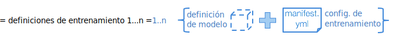
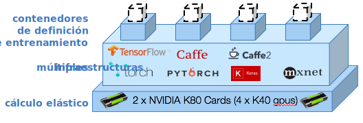

---

copyright:
  years: 2016, 2017
lastupdated: "2017-11-16"

---
{:new_window: target="_blank"}
{:shortdesc: .shortdesc}
{:screen: .screen}
{:codeblock: .codeblock}
{:pre: .pre}

# Introducción

<!--  -->

Como científico de datos, necesita entrenar a cientos de modelos para identificar la combinación adecuada de datos más hiperparámetros que optimiza el rendimiento de las redes neuronales. Desea realizar más experimentos… y más rápido. Desea entrenar más redes y explorar más espacios de hiperparámetros. {{site.data.keyword.pm_full}} acelera este ciclo experimental simplificando el proceso para entrenar modelos en paralelo en un clúster de cálculo GPU elástico.
{: shortdesc}

Puede empezar del siguiente modo:
1. [Configure el entorno para {{site.data.keyword.pm_full}}](ml_getting_access.html)
2. [Instale la interfaz de línea de mandatos (CLI) de WML](ml_dlaas_environment.html)
3. Aprenda a configurar la ejecución de entrenamiento
4. Cargue datos de entrenamiento en la nube
5. Inicie el entrenamiento
6. Supervise y evalúe

## Configure cada ejecución de entrenamiento

{{site.data.keyword.pm_full}} le permite realizar experimentos de aprendizaje profundo rápidamente presentando de 10 a 100 ejecuciones de entrenamiento que se pueden poner en cola para el entrenamiento. Una ejecución de entrenamiento consta de las siguientes partes: 

* Su modelo de red neuronal definido en [infraestructura de aprendizaje profundo soportada](ml_dlaas_supported_framework.html) 
* La configuración de cómo ejecutar el entrenamiento, que incluye el número de GPU y la ubicación del [almacenamiento de objetos que contiene el conjunto de datos](ml_dlaas_object_store.html)

[Se proporcionan ejecuciones de entrenamiento de ejemplo](ml_dlaas_working_with_sample_models.html) que incluyen datos alojados en un almacenamiento de objetos proporcionado por IBM. Lea los ejemplos para entender cómo está configurado manifest.yml en funcionamiento y, a continuación, vaya aquí para [aprender a definir sus propias ejecuciones de entrenamiento](ml_dlaas_working_with_new_models.html).  

## Cargue datos de entrenamiento en la nube

Antes de poder iniciar su entrenamiento de redes neuronales, primero debe mover los datos en la nube de IBM. Para ello, [cargue los datos de entrenamiento en una instancia de servicio de almacenamiento de objetos](ml_dlaas_object_store.html). Cuando haya terminado el entrenamiento, se graba el resultado de sus ejecuciones de entrenamiento en su almacenamiento de objetos para que pueda arrastrar archivos a su escritorio.

## Inicie el entrenamiento

Después de crear las definiciones de entrenamiento, utilice la [CLI (Command Line Interface, interfaz de línea de mandatos)](ml_dlaas_environment.html) para enviar los trabajos a {{site.data.keyword.pm_full}}. {{site.data.keyword.pm_full}} empaqueta cada una de las ejecuciones de entrenamiento y las asigna a un contenedor de Kubernetes con los recursos solicitados y una infraestructura de aprendizaje profundo. Las ejecuciones de entrenamiento se ejecutan en paralelo, dependiendo de los recursos de GPU disponibles para su nivel de cuenta. Para las cuentas gratuitas, está limitado a 1 GPU, por lo que se ponen en cola todas las ejecuciones adicionales.

Como se indica en el diagrama anterior, se asignan 4 ejecuciones de entrenamiento a 4 contenedores. Cada uno de estos contenedores aloja la infraestructura de aprendizaje profundo que requiere la ejecución de entrenamiento y tiene acceso a un único K40 GPU (en esta instancia). Todos los recursos están asignados de forma elástica, de forma que sólo se le cobrará desde el momento en que se asigna un GPU a la ejecución del entrenamiento hasta que se complete el entrenamiento y los datos de salida se transfieran a la instancia de Object Storage.

## Pasos siguientes

Empiece a utilizar estas [ejecuciones de entrenamiento de ejemplo](ml_dlaas_working_with_sample_models.html) o cree sus propias [ejecuciones de entrenamiento nuevas](ml_dlaas_working_with_new_models.html).
