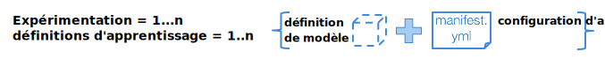

---

copyright:
  years: 2016, 2017
lastupdated: "2017-11-16"

---
{:new_window: target="_blank"}
{:shortdesc: .shortdesc}
{:screen: .screen}
{:codeblock: .codeblock}
{:pre: .pre}

# Création d'une session d'apprentissage

Les sessions d'apprentissage constituent le principe organisateur de la conduite d'expériences d'apprentissage en profondeur dans {{site.data.keyword.pm_full}}. Une expérimentation type peut regrouper des dizaines, voire des centaines de sessions d'apprentissage. Chaque série est définie individuellement et comprend les composants suivants : le réseau de neurones défini à l'aide de l'une des [infrastructures d'apprentissage en profondeur prises en charge](ml_dlaas_supported_framework.html) et la configuration indiquant les modalités d'exécution de l'apprentissage, notamment le nombre de processeurs graphiques et l'emplacement du stockage d'objets contenant votre jeu de données.
{: shortdesc}

<p align="center"></p>

## Création d'un fichier .zip de définition de modèle

Une fois que vous avez défini le réseau de neurones et le traitement des données associées à l'aide de l'une des [infrastructures d'apprentissage en profondeur](ml_dlaas_supported_framework.html), vous devez compresser l'ensemble de ces fichiers au format .zip. Par exemple, si le modèle a été créé sous Torch, vous devez compresser vos fichiers .lua, s'il a été créé sous Caffe,  vous devez compresser le fichier .prototxt, ou s'il a été créé sous Tensorflow/Keras/MXNet, vous devez compresser vos fichiers .py. Les autres formats de compression, tels que gzip ou tar, ne sont pas pris  en charge. Consultez la documentation relative à l'infrastructure d'apprentissage en profondeur que vous souhaitez utiliser pour préparer les fichiers de définition du modèle.  

<!-- Supposedly this isn't true anymore >> NOTE: All model definition files must be in the first level of the zip file so ensure there are no nested directories in the zip file. -->

Par exemple, un fichier zip `tf-model.zip` incluant la définition de modèle de tensorflow peut avoir la sortie suivante :

```
unzip -l tf-model.zip
```
{: codeblock}

Exemple de sortie :

```
Archive:  tf-model.zip
  Length      Date    Time    Name
---------  ---------- -----   ----
     7094  09-21-2017 11:38   convolutional_network.py
     5486  09-19-2017 13:49   input_data.py
---------                     -------
    12580                     2 files
```
{: codeblock}

## Téléchargement des données d'apprentissage

Vos données d'apprentissage doivent être [téléchargées vers une instance de service Object Storage compatible](ml_dlaas_object_store.html). Les données d'identification de cette instance Object Storage seront utilisées ci-dessous dans votre fichier manifeste. Le conteneur d'objets est également utilisé pour stocker le modèle formé à l'issue de votre session d'apprentissage.

## Création d'un fichier manifeste d'apprentissage

Le manifeste est un fichier formatté YAML qui comporte plusieurs zones décrivant le modèle à entraîner, notamment l'infrastructure d'apprentissage en profondeur à utiliser, la configuration du stockage d'objets dans le cloud, les besoins en ressources et plusieurs arguments (y compris les hyperparamètres) nécessaires à l'exécution du modèle pendant les procédures d'apprentissage et de test. Vous trouverez ci-dessous une description de chacune des zones contenues dans le fichier d'apprentissage du modèle pour l'apprentissage en profondeur, avec la suite de notre exemple de reconnaissance d'écriture tensorflow.

* `model_definition.name` : Vous pouvez entrer le nom de votre choix afin d'identifier votre travail d'apprentissage après son lancement. Celui-ci ne doit pas forcément être unique. En effet, le service attribue une valeur model-id unique à chaque travail d'apprentissage lancé.
* `model_definition.description` : Autre zone permettant de décrire le travail.
* `model_definition.author` : Zone facultative. Renseignez le nom de l'auteur et l'adresse électronique sous les clés *name* et *email*.
* `model_definition.framework` : Cette zone fournit les informations spécifiques à l'infrastructure auxquels le nom et la version doivent correspondre dans l'une des [Infrastuctures d'apprentissage en profondeur prises en charge](ml_dlaas_supported_framework.html).
    - `model_definition.framework.name` : Nom de l'infrastructure
    - `model_definition.framework.version` : Version de l'infrastructure.
* `model_definition.execution` : Fournit des informations sur la commande à exécuter pour lancer l'apprentissage.
    - `model_definition.execution.command` : Identifie le fichier programme principal avec les arguments devant être exécutés par l'apprentissage en profondeur.
    - `model_definition.execution.resource` : Indique les ressources qui seront attribuées à l'apprentissage parmi les valeurs - `small` (1 processeur graphique), `medium` (2 processeurs graphiques), `large` (4 processeurs graphiques).
* `training_data_reference` : Liste des conteneurs d'objets à partir desquels sont téléchargés les fichiers de données utilisés pour entraîner le modèle. A l'heure actuelle, cette liste ne contient qu'une seul et unique conteneur d'objets, avec la définition suivante :
    - `connection` : Variables de connexion du magasin de données.
    - `source.type` : Type de magsin de données (seulement s3 ou bluemix_objectstore, à l'heure actuelle). Utilisez `s3` si votre instance Object Storage est de type *Cloud Object Storage (IaaS)* et `bluemix_objectstore` si votre instance Object Storage est de type *Object Storage OpenStack Swift for Bluemix*.
    - `source.bucket` : Compartiment où sont hébergées les données d'apprentissage.
* `training_results_reference` : Indique le conteneur d'objets où les fichiers et journaux du modèle seront stockés après l'exécution de l'apprentissage.
    - `connection` : Variables de connexion du magasin de données. La liste des variables de connexion prises en charge dépend du type de magasin de données.
    - `target.type` : Type de magasin de données (seulement s3 ou bluemix_objectstore, à l'heure actuelle). Utilisez `s3` si votre instance Object Storage est de type *Cloud Object Storage (IaaS)* et `bluemix_objectstore` si votre instance Object Storage est de type *Object Storage OpenStack Swift for Bluemix*.
    - `target.bucket` : Compartiment où sont écrits les résultats de l'apprentissage.

Par exemple, le fichier de définition d'apprentissage du modèle suivant peut être utilisé pour définir un travail d'apprentissage d'un modèle tensorflow :

```
model_definition:
  framework:
    name: tensorflow
    version: 1.2-py3
  name: tf-mnist-showtest1
  author:
    name: WML User
    email: wmluser@ibm.com
  description: Simple MNIST model implemented in TF
  execution:
    command: python3 convolutional_network.py --trainImagesFile ${DATA_DIR}/train-images-idx3-ubyte.gz
      --trainLabelsFile ${DATA_DIR}/train-labels-idx1-ubyte.gz --testImagesFile ${DATA_DIR}/t10k-images-idx3-ubyte.gz
      --testLabelsFile ${DATA_DIR}/t10k-labels-idx1-ubyte.gz --learningRate 0.001
      --trainingIters 2000000
    resource: small
training_data:
- connection:
    endpoint_url: <auth-url>
    aws_access_key_id: <username>
    aws_secret_access_key: <password>
  source:
    bucket: mnist-training-data
    type: s3
training_results:
  connection:
    endpoint_url: <auth-url>
    aws_access_key_id: <username>
    aws_secret_access_key: <password>
  target:
    bucket: mnist-training-models
    type: s3
```
{: codeblock]

où `convolutional_network.py` désigne le programme tensorflow à exécuter (inclus dans le zip de définition du modèle) et les éléments restants désignent les arguments du programme.  Les arguments du programme `--trainImagesFile train-images-idx3-ubyte.gz`, `--trainLabelsFile train-labels-idx1-ubyte.gz`, `--testImagesFile t10k-images-idx3-ubyte.gz`, `--testLabelsFile t10k-labels-idx1-ubyte.gz` font référence aux chemins d'accès aux jeux de données dans le conteneur d'objets `tf_training_data`. Les arguments du programme `--trainingIters 20000` et `--learningRate 0.001` transmlettent les valeurs des hyperparamètres.

**Remarque** : Lorsque les fichiers de définition du modèle ou de la configuration d'apprentissage font référence aux fichiers téléchargés vers l'instance Object Storage, ces  références doivent utiliser des chemins relatifs, comme indiqué ci-dessus.

**Remarque** : Avant que l'apprentissage ne commence, tous les fichiers inclus dans le compartiment des données d'apprentissage sont téléchargés vers l'environnement d'apprentissage exploité par le service. Afin d'éviter une surcharge/un délai de transfet de fichiers inutiles, conservez les fichiers d'apprentissage dans des compartiments séparés.

**Remarque** : Dans l'exemple ci-dessus, le conteneur d'objets utilisé pour fournir les données et stocker le modèle obtenu est *Cloud Object Storage (IaaS)*.  Si, par contre, le conteneur d'objets en cours d'utilisation était *Object Storage Open Stack Swift for Bluemix*, les clés de connexion seraient différentes. Vous trouverez d'ailleurs ci-dessous un exemple de manifeste :

```
model_definition:
  framework:
    name: tensorflow
    version: 1.2-py3
  name: tf-mnist-showtest1
  author:
    name: WML User
    email: wmluser@ibm.com
  description: Simple MNIST model implemented in TF
  execution:
    command: python3 convolutional_network.py --trainImagesFile ${DATA_DIR}/train-images-idx3-ubyte.gz
      --trainLabelsFile ${DATA_DIR}/train-labels-idx1-ubyte.gz --testImagesFile ${DATA_DIR}/t10k-images-idx3-ubyte.gz
      --testLabelsFile ${DATA_DIR}/t10k-labels-idx1-ubyte.gz --learningRate 0.001
      --trainingIters 2000000
    resource: small
training_data_reference:
- connection:
    auth_url: <auth-url>
    user_name: <username>
    password: <password>
    region: <region>
    domain_name: <domain-name>
    project_id: <project-id>
  source:
    bucket: mnist-training-data
    type: bluemix_objectstore
training_results_reference:
  connection:
    auth_url: <auth-url>
    user_name: <username>
    password: <password>
    region: <region>
    domain_name: <domain-name>
    project_id: <project-id>
  target:
    bucket: mnist-training-models
    type: bluemix_objectstore
```
{: codeblock]

**Remarque** : Pour les connexions *Object Storage Open Stack Swift for Bluemix*, un mappage doit exister entre les noms de clés provenant des données d'identification de votre conteneur d'objets et les noms de clés requis dans le manifeste :

| {{site.data.keyword.Bluemix_notm}} Credential key  | Training Manifest Credentials key |
|----------------------------------------------------|----------------------------------------|
|auth_url |auth_url |
|username |user_name |
|password |password |
|projectId |project_id |
|region |region |
|domainName |domain_name |
{: caption="Tableau 1. {{site.data.keyword.Bluemix_notm}} et les clés d'identification du manifeste d'apprentissage" caption-side="top"}

## Soumission d'une session d'apprentissage

Une fois que vous avez préparé les fichiers de configuration d'apprentissage et les fichiers .zip de définition du modèle, vous devez soumettre le travail à l'aide de la commande `bx ml train` : `bx ml train <path-to-model-definition-zip> <path-to-model-configuration-yaml>` 

```
bx ml train tf-model.zip job.yaml
```
{: codeblock}

Exemple de sortie :

Lorsque la commande a été correctement soumise, un ID de modèle unique est renvoyé. Par exemple, la sortie ci-dessous illustre une valeur `Model-ID` de `training-DOl4q2LkR` :

```
Starting to train ...
OK
Model-ID is 'training-DOl4q2LkR'
```

# Surveillance d'une session d'apprentissage

Pour répertorier l'ensemble des travaux d'apprentissage (qu'ils soient terminés ou non), utilisez la commande de l'interface CLI `bx ml list trained-models`

```
bx ml list trained-models
```
{: codeblock}

Exemple de sortie :

```
Fetching the list of trained models ...
SI No   Name                       guid                 status    submitted-at
1       tf-mnist                   training-DOl4q2LkR   pending   2017-10-26T11:16:51Z

1 records found.
OK
List all trained-models successful
```
{: codeblock}

**Remarque** : Le service conserve les détails des travaux d'apprentissage pendant un délai de 7 jours, délai au-delà duquel ils sont supprimés et disparaissent de cette liste.

Pour surveiller un travail particulier, utilisez la commande de l'interface CLI `bx ml show trained-models <model-id>`:

```
bx ml show trained-models training-DOl4q2LkR
```
{: codeblock}

Exemple de sortie :

```
Fetching the trained model details with MODEL-ID 'training-DOl4q2LkR' ...
ModelId        training-DOl4q2LkR
url            /v3/models/training-DOl4q2LkR
Name           tf-mnist
State          running
Submitted_at   2017-10-26T11:10:37Z
OK
Show trained-models details successful
```
{: codeblock}

**Remarque** : Il existe un problème connu comme quoi les travaux ayant échoué n'apparaissent plus dans la liste et apparaissent comme ayant été supprimés dans la sortie de la commande de l'interface CLI. Ce problème devrait être corrigé, mais pour l'heure, vérifiez les fichiers journaux d'apprentissage ci-dessous pour découvrir la raison de l'échec du travail.

Lorsqu'un travail se termine correctement (ou échoue), les fichiers et journaux du modèle formé doivent être consignés dans le compartiment Cloud Object Storage spécifié dans le paramètre `training_results_reference` du fichier de définition d'apprentissage du modèle, sous un dossier portant le même nom que l'ID du modèle.

## Suppression d'une session d'apprentissage

Lorsque vous supprimez un travail d'apprentissage, le modèle formé et les journaux ayant été consignés dans votre instance Object Storage ne sont pas effacés, mais l'historique du travail d'apprentissage est supprimé du service.

```
bx ml delete trained-models training-DOl4q2LkR
```
{: codeblock}


Exemple de sortie :

```
Deleting the trained model 'training-DOl4q2LkR' ...
OK
Delete trained-models successful
```
{: codeblock}
