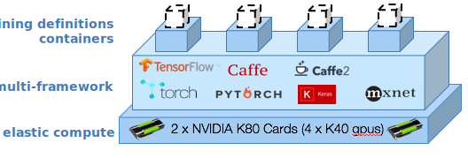

---

copyright:
  years: 2016, 2017
lastupdated: "2017-11-16"

---
{:new_window: target="_blank"}
{:shortdesc: .shortdesc}
{:screen: .screen}
{:codeblock: .codeblock}
{:pre: .pre}

# Introduzione 

<!--  -->

Come data scientist, devi formare centinaia di modelli per identificare la combinazione corretta di dati più i hyperparameter che ottimizzano le prestazioni della tua rete neurale.  Vuoi eseguire più esperimenti…e più velocemente.  Vuoi preparare le reti più approfonditamente e esplorare gli spazi più ampiamente. {{site.data.keyword.pm_full}} accelera questo ciclo sperimentale semplificando il processo di formazioni in parallelo a un cluster di calcolo GPU elastico.
{: shortdesc}

Ecco come iniziare:
1. [Configura il tuo ambiente per {{site.data.keyword.pm_full}}](ml_getting_access.html)
2. [Installa la CLI (command line interface) WML](ml_dlaas_environment.html)
3. Impara come configurare la tua esecuzione di formazione
4. Carica i dati di formazione nel cloud
5. Avvia la formazione
6. Monitora e convalida

## Configura ogni esecuzione di formazione

{{site.data.keyword.pm_full}} ti consente di condurre rapidamente esperimenti di apprendimento approfondito inviando 10-100 esecuzioni di formazione che possono essere accodate per la formazione. Un'esecuzione di formazione è formata dalle seguenti parti: 

* Il tuo modello di rete neurale definito nei [framework di apprendimento approfondito supportati](ml_dlaas_supported_framework.html) 
* La configurazione su come eseguire la tua formazione, che include il numero di GPU e l'ubicazione dell'[archivio dell'oggetto che contiene il tuo dataset](ml_dlaas_object_store.html)

[Vengono fornite le esecuzioni di formazione di esempio](ml_dlaas_working_with_sample_models.html) che includono i dati ospitati in un archivio dell'oggetto fornito da IBM. Utilizza questi esempi per comprendere come utilizzare i manifest.yml configurati e quindi vai a [informazioni su come definire le tue proprie esecuzioni di formazione](ml_dlaas_working_with_new_models.html).  

## Carica i dati di formazione nel cloud

Prima di poter iniziare a formare le tue reti neurali, devi prima spostare i tuoi dati in IBM Cloud.  Per far ciò, [carica i tuoi dati di formazione in un'istanza del servizio di archivio dell'oggetto](ml_dlaas_object_store.html).  Quando hai terminato la formazione, l'output delle tue esecuzioni di formazione viene scritto nel tuo archivio dell'oggetto in modo che puoi trascinare i file nel tuo desktop.

## Inizia la formazione

Dopo aver creato le tue definizioni di formazione, utilizza la [CLI (Command Line Interface)](ml_dlaas_environment.html) per inviare i tuoi lavori a {{site.data.keyword.pm_full}}. {{site.data.keyword.pm_full}} impacchetta ognuna delle tue esecuzioni di formazione e le assegna a un contenitore Kubernetes con le risorse richieste e il framework di di apprendimento approfondito.  Le esecuzioni di formazione vengono eseguite a seconda delle risorse GPU disponibili al tuo livello dell'account.  Per gli account gratuiti, sei limitato a 1 GPU per cui tutte le ulteriori esecuzioni vengono accodate.

Come indicato nel precedente diagramma, vengono assegnate 4 esecuzioni di formazione a 4 contenitori.  Ognuno di questi contenitori ospita il framework di apprendimento approfondito richiesto dall'esecuzione di formazione e ha accesso a un solo K40 GPU (in questa istanza).  Tutte le risorse sono assegnate in modo elastico per cui vieni addebitato solo dal momento in cui la tua esecuzione di formazione viene assegnata a un GPU fino al completamento della formazione e a che i dati di output vengono trasferiti alla tua istanza dell'archivio dell'oggetto.

## Operazioni successive 

Inizia utilizzando queste [esecuzioni di formazione di esempio](ml_dlaas_working_with_sample_models.html) o crea le tue proprie [nuove esecuzioni di formazione](ml_dlaas_working_with_new_models.html).
