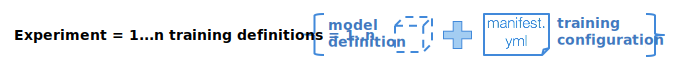

---

copyright:
  years: 2016, 2017
lastupdated: "2017-11-16"

---
{:new_window: target="_blank"}
{:shortdesc: .shortdesc}
{:screen: .screen}
{:codeblock: .codeblock}
{:pre: .pre}

# Crea un'esecuzione di formazione

Le esecuzioni di formazione sono il principio organizzativo per condurre gli esperimenti di apprendimento approfondito in {{site.data.keyword.pm_full}}. Un esperimento tipico potrebbe essere formato da dozzine di centinaia di esecuzioni di formazione. Ogni esecuzione viene definita individualmente ed è composta dalle seguenti parti: la rete neurale definita utilizzando uno dei [framework di apprendimento approfondito supportati](ml_dlaas_supported_framework.html) e la configurazione su come eseguire la tua formazione includendo il numero di GPU e l'ubicazione dell'archivio dell'oggetto che contiene il tuo dataset.
{: shortdesc}

<p align="center"></p>

## Creazione di un file .zip di definizione del modello

Dopo aver definito la rete neurale e la gestione dei dati associati utilizzando uno dei [framework di apprendimento approfondito supportati](ml_dlaas_supported_framework.html), impacchetta questi file utilizzando il formato .zip. Ad esempio, se il modello è stato scritto in Torch impacchetta i tuoi file .lua; se in Caffe comprimi il file .prototxt; o se in Tensorflow/Keras/MXNet comprimi i tuoi file .py.  Gli altri formati di compressione, come gzip o tar non sono supportati. Consulta la documentazione per il framework di apprendimento approfondito che desideri utilizzare per poter preparare i file di definizione del modello.   

<!-- Supposedly this isn't true anymore >> NOTE: All model definition files must be in the first level of the zip file so ensure there are no nested directories in the zip file. -->

Ad esempio, un file zip `tf-model.zip` che contiene la definizione per tensorflow potrebbe contenere il seguente output:

```
unzip -l tf-model.zip
```
{: codeblock}

Output di esempio:

```
Archive:  tf-model.zip
  Length      Date    Time    Name
---------  ---------- -----   ----
     7094  09-21-2017 11:38   convolutional_network.py
     5486  09-19-2017 13:49   input_data.py
---------                     -------
    12580                     2 files
```
{: codeblock}

## Carica i dati di formazione 

I tuoi dati di formazione devono essere [caricati in un'istanza del servizio Object Storage compatibile](ml_dlaas_object_store.html). Le credenziali da tale istanza Object Storage saranno utilizzati di seguito nel tuo file manifest. L'archivio dell'oggetto viene anche utilizzato per archiviare il modello eseguito alla fine della tua esecuzione di formazione.

## Creazione di un file manifest di formazione

Il manifest è un file formattato YAML che contiene diversi campi che descrivono il modello da formare, incluso il framework di apprendimento approfondito da utilizzare, la configurazione dell'archivio dell'oggetto cloud, i requisiti della risorsa e diversi argomenti (inclusi i hyperparameter) necessari per l'esecuzione del modello durante la formazione e la verifica. Di seguito descriviamo i diversi campi del file di formazione del modello per l'apprendimento approfondito, continuando il nostro esempio di riconoscimento di scrittura manuale tensorflow.

* `model_definition.name`: Puoi fornire qualsiasi valore al nome per identificare il tuo lavoro di formazione dopo averlo avviato.  Tuttavia, non deve esser univoco - il servizio assegnerà un ID del modello univoco ad ogni lavoro di formazione avviato.
* `model_definition.description`: Questo è un altro campo che puoi utilizzare per descrivere il lavoro.
* `model_definition.author`: Facoltativo.  Fornisce l'indirizzo email il nome dell'autore nelle chiavi *name* e *email*.
* `model_definition.framework`: Questo campo fornisce informazioni specifiche per il framework, il nome e la versione devono corrispondere a quelli di uno dei [framework di apprendimento approfondito supportati](ml_dlaas_supported_framework.html).
    - `model_definition.framework.name`: Nome del framework
    - `model_definition.framework.version`: Versione del framework.
* `model_definition.execution`: Questo campo fornisce le informazioni riguardanti il comando per avviare la formazione.
    - `model_definition.execution.command`: Questo campo identifica il file di programma principale insieme a tutti gli argomenti che l'apprendimento approfondito deve eseguire.
    - `model_definition.execution.resource`: Questo campo specifica le risorse che saranno assegnate per la formazione e dovrebbe essere uno dei seguenti valori - `small` (1 GPU), `medium` (2 GPU), `large` (4 GPU)
* `training_data_reference`: Questa sezione specifica un elenco di archivi dell'oggetto da cui vengono caricati i file di dati utilizzati per formare il modello.  Al momento questo elenco dovrebbe contenere uno e uno solo archivio dell'oggetto, con la seguente definizione:
    - `connection`: Le variabili di connessione per l'archivio dati.
    - `source.type`: Il tipo di origine dati, al momento può essere impostato solo su s3 o bluemix_objectstore.  Utilizza `s3` se la tua istanza Object Storage è *Cloud Object Storage (IaaS)* e `bluemix_objectstore` se è *Object Storage OpenStack Swift per Bluemix*.
    - `source.bucket`: Il bucket in cui risiedono i dati di formazione.
* `training_results_reference`: Questa sezione specifica l'archivio dell'oggetto in cui saranno archiviati i log e i file del modello risultanti dopo il completamento della formazione.
    - `connection`: Le variabili di connessione per l'archivio dati. L'elenco delle variabili di connessione supportato è dipendente dal tipo di archivio dati.
    - `target.type`: Il tipo di origine dati, al momento può essere impostato solo su s3 o bluemix_objectstore.  Utilizza `s3` se la tua istanza Object Storage è *Cloud Object Storage (IaaS)* e `bluemix_objectstore` se è *Object Storage OpenStack Swift per Bluemix*.
    - `target.bucket`: Il bucket in cui saranno scritti i risultati della formazione.

Ad esempio, il seguente file di definizione di formazione del modello, può essere utilizzato per definire un lavoro di formazione di un modello tensorflow:

```
model_definition:
  framework:
    name: tensorflow
    version: 1.2-py3
  name: tf-mnist-showtest1
  author:
    name: WML User
    email: wmluser@ibm.com
  description: Simple MNIST model implemented in TF
  execution:
    command: python3 convolutional_network.py --trainImagesFile ${DATA_DIR}/train-images-idx3-ubyte.gz
      --trainLabelsFile ${DATA_DIR}/train-labels-idx1-ubyte.gz --testImagesFile ${DATA_DIR}/t10k-images-idx3-ubyte.gz
      --testLabelsFile ${DATA_DIR}/t10k-labels-idx1-ubyte.gz --learningRate 0.001
      --trainingIters 2000000
    resource: small
training_data:
- connection:
    endpoint_url: <auth-url>
    aws_access_key_id: <username>
    aws_secret_access_key: <password>
  source:
    bucket: mnist-training-data
    type: s3
training_results:
  connection:
    endpoint_url: <auth-url>
    aws_access_key_id: <username>
    aws_secret_access_key: <password>
  target:
    bucket: mnist-training-models
    type: s3
```
{: codeblock]

dove `convolutional_network.py` è il programma tensorflow (che è parte dello zip di definizione del modello) da eseguire mentre il resto sono argomenti del programma.  I valori `--trainImagesFile train-images-idx3-ubyte.gz`, `--trainLabelsFile train-labels-idx1-ubyte.gz`, `--testImagesFile t10k-images-idx3-ubyte.gz`, `--testLabelsFile t10k-labels-idx1-ubyte.gz` degli argomenti del programma fanno riferimento ai percorsi dei dataset nel contenitore dell'archivio dell'oggetto `tf_training_data`. Gli argomenti del programma `--trainingIters 20000` e `--learningRate 0.001` passano i valori dei hyperparameter.

**Nota**: quando i file di definizione del modello o della configurazione di formazione fanno riferimento ai file caricati nell'istanza Object Storage, i riferimenti dovrebbero utilizzare i percorsi relativi come mostrato di seguito.

**Nota**: prima di iniziare la formazione, tutti i file nel bucket di dati di formazione vengono scaricati nell'ambiente di formazione gestito dal servizio.  Per evitare il sovraccarico/ritardo di trasferimento di file non necessari, mantiene i file non utilizzati per i file di formazione in bucket separati.

**Nota**: nel seguente esempio l'archivio dell'oggetto utilizzato per fornire i dati e archiviare il modello risultante è *Cloud Object Storage (IaaS)*.  Se invece, l'archivio dell'oggetto che sta venendo utilizzato era *Object Storage Open Stack Swift per Bluemix*, le chiavi di connessione dovrebbero essere differenti, viene di seguito fornito un manifest di esempio:

```
model_definition:
  framework:
    name: tensorflow
    version: 1.2-py3
  name: tf-mnist-showtest1
  author:
    name: WML User
    email: wmluser@ibm.com
  description: Simple MNIST model implemented in TF
  execution:
    command: python3 convolutional_network.py --trainImagesFile ${DATA_DIR}/train-images-idx3-ubyte.gz
      --trainLabelsFile ${DATA_DIR}/train-labels-idx1-ubyte.gz --testImagesFile ${DATA_DIR}/t10k-images-idx3-ubyte.gz
      --testLabelsFile ${DATA_DIR}/t10k-labels-idx1-ubyte.gz --learningRate 0.001
      --trainingIters 2000000
    resource: small
training_data_reference:
- connection:
    auth_url: <auth-url>
    user_name: <username>
    password: <password>
    region: <region>
    domain_name: <domain-name>
    project_id: <project-id>
  source:
    bucket: mnist-training-data
    type: bluemix_objectstore
training_results_reference:
  connection:
    auth_url: <auth-url>
    user_name: <username>
    password: <password>
    region: <region>
    domain_name: <domain-name>
    project_id: <project-id>
  target:
    bucket: mnist-training-models
    type: bluemix_objectstore
```
{: codeblock]

**Nota** per le connessioni *Object Storage Open Stack Swift per Bluemix*, l'associazione tra i nomi chiave dalle tue credenziali Object Store e quelli richiesti nel manifest:

| Chiave credenziale {{site.data.keyword.Bluemix_notm}}   | Chiavi credenziali manifest formazione |
|----------------------------------------------------|----------------------------------------|
|auth_url |auth_url |
|username |user_name |
|password |password |
|projectId |project_id |
|region |region |
|domainName |domain_name |
{: caption="Tabella 1. Chiavi credenziale manifest formazione e {{site.data.keyword.Bluemix_notm}} " caption-side="top"}

## Invia un'esecuzione di formazione

Dopo aver preparato i file di configurazione di formazione e i file .zip della definizione del modello, invia il lavoro utilizzando il comando `bx ml train`: `bx ml train <path-to-model-definition-zip> <path-to-model-configuration-yaml>` 

```
bx ml train tf-model.zip job.yaml
```
{: codeblock}

Output di esempio:

Quando il comando viene inviato correttamente, viene restituito un ID del modello univoco: Ad esempio, il seguente output mostra un valore `Model-ID` di `training-DOl4q2LkR`:

```
Starting to train ...
OK
Model-ID is 'training-DOl4q2LkR'
```

# Monitora un'esecuzione di formazione

Per elencare tutti i lavori di formazione (se completati o meno) utilizza il comando cli `bx ml list trained-models`

```
bx ml list trained-models
```
{: codeblock}

Output di esempio:

```
Fetching the list of trained models ...
SI No   Name                       guid                 status    submitted-at
1       tf-mnist                   training-DOl4q2LkR   pending   2017-10-26T11:16:51Z

1 records found.
OK
List all trained-models successful
```
{: codeblock}

**Nota**: il servizio conserverà i dettagli dei lavori di formazione solo per 7 giorni dopodiché saranno rimossi e non saranno visualizzati nell'elenco.

Per monitorare un lavoro in particolare utilizza il comando cli `bx ml show trained-models <model-id>`:

```
bx ml show trained-models training-DOl4q2LkR
```
{: codeblock}

Output di esempio:

```
Fetching the trained model details with MODEL-ID 'training-DOl4q2LkR' ...
ModelId        training-DOl4q2LkR
url            /v3/models/training-DOl4q2LkR
Name           tf-mnist
State          running
Submitted_at   2017-10-26T11:10:37Z
OK
Show trained-models details successful
```
{: codeblock}

**Nota**: al momento è presente un errore noto con i lavori non riusciti che scompaiono dall'elenco ma mostrati dall'output del comando della CLI, come se il lavoro fosse stato eliminato.  Questo problema sarà corretto ma nel frattempo, se vedi che un lavoro di formazione scompare, controlla i file di log di formazione come spiegato di seguito per scoprire perché il lavoro non è riuscito.

Quando un lavoro è stato completato correttamente (o non è riuscito) i log e i file del modello eseguito dovrebbero venire scritti nel bucket Cloud Object Storage specificato nell'impostazione `training_results_reference` all'interno del file di definizione di formazione del modello, in una cartella con lo stesso nome dell'ID del modello.

## Elimina un'esecuzione di formazione

Per eliminare un lavoro di formazione (questo non rimuoverà il modello eseguito e i log che sono l'output della tua istanza Object Storage ma rimuoverà tutta la cronologia del lavoro di formazione dal servizio).

```
bx ml delete trained-models training-DOl4q2LkR
```
{: codeblock}


Output di esempio:

```
Deleting the trained model 'training-DOl4q2LkR' ...
OK
Delete trained-models successful
```
{: codeblock}
