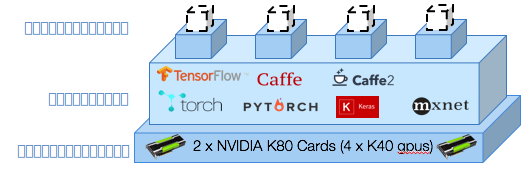

---

copyright:
  years: 2016, 2017
lastupdated: "2017-11-16"

---
{:new_window: target="_blank"}
{:shortdesc: .shortdesc}
{:screen: .screen}
{:codeblock: .codeblock}
{:pre: .pre}

# 概要

<!--  -->

データ・サイエンティストは、ニューラル・ネットワークのパフォーマンスを最適化するデータとハイパーパラメーターの正しい組み合わせを特定するため、数百のモデルのトレーニングを行う必要があります。しかし、もっと多くの試験を、もっと早く実行する必要があります。また、より深いネットワークをトレーニングし、ハイパーパラメーターのさらに広いスペースを探索する必要があります。{{site.data.keyword.pm_full}} は、1 つの弾性的 GPU 計算クラスターで複数のモデルを並行してトレーニングするよう処理を単純化することで、この試験サイクルを加速します。
{: shortdesc}

開始手順は次のとおりです。
1. [{{site.data.keyword.pm_full}} 用の環境のセットアップ](ml_getting_access.html)
2. [WML コマンド・ライン・インターフェース (CLI) のインストール](ml_dlaas_environment.html)
3. トレーニング実行の構成方法を学ぶ
4. トレーニング・データをクラウドへアップロードする
5. トレーニングの開始
6. モニターおよび評価

## 各トレーニング実行の構成

{{site.data.keyword.pm_full}} を使用すると、10 から 100 ほどのトレーニング実行をサブミットすることによって (それらはトレーニングのためにキューに入れることができます)、迅速に深層学習試験を実施できます。トレーニング実行は次の部分から構成されます。 

* [サポートされる深層学習フレームワーク](ml_dlaas_supported_framework.html)に定義されたニューラル・ネットワーク・モデル 
* トレーニングをどのように実行するのかについての構成。この構成には、GPU の数と、[データ・セットを含んでいるオブジェクト・ストレージ](ml_dlaas_object_store.html)の場所が含まれます。

IBM 提供のオブジェクト・ストレージでホストされているデータを含んでいる [トレーニング実行の例](ml_dlaas_working_with_sample_models.html)が用意されています。それらの例に目を通して、機能する manifest.yml がどのように構成されるのかを理解し、その後、[独自のトレーニング実行の定義方法](ml_dlaas_working_with_new_models.html)を学習してください。  

## トレーニング・データをクラウドへアップロードする

ニューラル・ネットワークのトレーニングを開始する前に、まずデータを IBM Cloud に移す必要があります。これを行うには、[トレーニング・データをオブジェクト・ストレージ・サービス・インスタンスにアップロードします](ml_dlaas_object_store.html)。 トレーニングが終了したら、トレーニング実行の出力はオブジェクト・ストレージに書き込まれ、デスクトップにファイルをドラッグできるようになります。

## トレーニングの開始

トレーニング定義を作成した後、[CLI (コマンド・ライン・インターフェース)](ml_dlaas_environment.html) を使用してジョブを {{site.data.keyword.pm_full}} に実行依頼します。{{site.data.keyword.pm_full}} は、各トレーニング実行をパッケージし、要求されたリソースおよび深層学習フレームワークと共に Kubernetes コンテナーにそれらを割り振ります。トレーニング実行は、お客様のアカウント・レベルで使用可能な GPU リソースに基づいて、並行して実行されます。無料アカウントの場合、1 個の GPU に制限されるため、すべての追加実行はキューに入れられます。

前の図で示されているように、4 つのトレーニング実行が 4 つのコンテナーに割り振られます。各コンテナーは、トレーニング実行が必要とする深層学習フレームワークをホストし、 単一の K40 GPU にアクセスできます (この例の場合)。すべてのリソースは弾性的に割り振られるため、トレーニング実行が GPU に割り振られた時点から、トレーニングが完了して、出力データがオブジェクト・ストレージ・インスタンスに転送されるまでの期間のみが課金の対象になります。

## 次のステップ

[トレーニング実行サンプル](ml_dlaas_working_with_sample_models.html)を使用して開始するか、または、独自の[新規トレーニング実行](ml_dlaas_working_with_new_models.html)を作成します。
