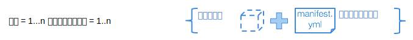

---

copyright:
  years: 2016, 2017
lastupdated: "2017-11-16"

---
{:new_window: target="_blank"}
{:shortdesc: .shortdesc}
{:screen: .screen}
{:codeblock: .codeblock}
{:pre: .pre}

# トレーニング実行の作成

トレーニング実行は、{{site.data.keyword.pm_full}} での深層学習試験の実施に関する編成原理です。標準的な試験では、1 つの試験が数十から数百のトレーニング実行からなります。各実行は個々に定義され、[サポートされる深層学習フレームワーク](ml_dlaas_supported_framework.html)の 1 つを使用して定義されるニューラル・ネットワークと、トレーニングをどのように実行するのかについての構成からなります。この構成には、GPU の数と、データ・セットを含んでいるオブジェクト・ストレージの場所が含まれます。
{: shortdesc}

<p align="center"></p>

## モデル定義 .zip ファイルの作成

[サポートされる深層学習フレームワーク](ml_dlaas_supported_framework.html)の 1 つを使用してニューラル・ネットワークおよび関連付けられたデータ処理を定義した後、.zip 形式を使用してこれらのファイルを一緒にパッケージします。例えば、Torch で書かれたモデルの場合は .lua ファイルをパッケージします。Caffe の場合は .prototxt ファイルを圧縮し、Tensorflow/Keras/MXNet の場合は .py ファイルを圧縮します。その他の圧縮形式 (gzip や tar など) はサポートされていません。詳しくは、モデル定義ファイルを準備するために使用する深層学習フレームワークの資料を参照してください。  

<!-- Supposedly this isn't true anymore >> NOTE: All model definition files must be in the first level of the zip file so ensure there are no nested directories in the zip file. -->

例えば、tensorflow のモデル定義が含まれている zip ファイル `tf-model.zip` の内容は次の出力のようになります。

```
unzip -l tf-model.zip
```
{: codeblock}

サンプル出力:

```
Archive:  tf-model.zip
  Length      Date    Time    Name
---------  ---------- -----   ----
     7094  09-21-2017 11:38   convolutional_network.py
     5486  09-19-2017 13:49   input_data.py
---------                     -------
    12580                     2 files
```
{: codeblock}

## トレーニング・データのアップロード

トレーニング・データは[互換のオブジェクト・ストレージ・サービス・インスタンスにアップロード](ml_dlaas_object_store.html)される必要があります。そのオブジェクト・ストレージ・インスタンスからの資格情報が、下記のマニフェスト・ファイル内で使用されます。オブジェクト・ストアも、トレーニング実行の終わりにトレーニング済みモデルを保管するために使用されます。

## トレーニング・マニフェスト・ファイルの作成

マニフェストは YAML 形式のファイルであり、使用する深層学習フレームワーク、クラウド・オブジェクト・ストレージ構成、リソース要件、および、トレーニングおよびテスト中にモデル実行のために必要ないくつかの引数 (ハイパーパラメーターを含む) など、トレーニングするモデルを記述するさまざまなフィールドを含んでいます。以下に、深層学習用のモデル・トレーニング・ファイルの各種フィールドを、引き続き tensorflow の手書き文字認識の例を使用して示します。

* `model_definition.name`: 起動された後にトレーニング・ジョブを識別するのに役立つよう、任意の値を使用して名前を付けることができますが、これは固有である必要はありません。起動されたトレーニング・ジョブごとに、固有のモデル ID がサービスによって割り当てられます。
* `model_definition.description`: これは、ジョブを記述するために使用できるもう 1 つのフィールドです。
* `model_definition.author`: オプション。 *name* および *email* というキーの下に、作成者の名前と E メール・アドレスを指定します。
* `model_definition.framework`: このフィールドは、フレームワーク固有の情報を提供します。名前とバージョンは、[サポートされる深層学習フレームワーク](ml_dlaas_supported_framework.html)のいずれかと一致している必要があります。
    - `model_definition.framework.name`: フレームワークの名前。
    - `model_definition.framework.version`: フレームワークのバージョン。
* `model_definition.execution`: このフィールドは、トレーニングを起動するコマンドに関する情報を提供します。
    - `model_definition.execution.command`: このフィールドは、深層学習が実行する必要のあるメインプログラム・ファイルを引数と共に指定します。
    - `model_definition.execution.resource`: このフィールドは、トレーニングのために割り振られるリソースを指定します。値は `small` (1 GPU)、`medium` (2 GPU)、`large` (4 GPU) のいずれかでなければなりません。
* `training_data_reference`: このセクションは、モデルのトレーニングに使用されるデータ・ファイルのロード元となるオブジェクト・ストアのリストを指定します。現在のところ、このリストに含まれるのは、次のように定義される 1 つのみのオブジェクト・ストアでなければなりません。
    - `connection`: データ・ストアの接続変数。
    - `source.type`: データ・ストアのタイプ。現在のところ、s3 または bluemix_objectstore のいずれかにのみ設定できます。ご使用のオブジェクト・ストレージ・インスタンスが *Cloud Object Storage (IaaS)* の場合は `s3` を、*Object Storage OpenStack Swift for Bluemix* の場合は `bluemix_objectstore` を使用してください。
    - `source.bucket`: トレーニング・データが置かれているバケット。
* `training_results_reference`: このセクションは、トレーニング完了後に結果のモデル・ファイルおよびログが保管されるオブジェクト・ストアを指定します。
    - `connection`: データ・ストアの接続変数。サポートされる接続変数のリストは、データ・ストアのタイプによって異なります。
    - `target.type`: データ・ストアのタイプ。現在のところ、s3 または bluemix_objectstore のいずれかにのみ設定できます。ご使用のオブジェクト・ストレージ・インスタンスが *Cloud Object Storage (IaaS)* の場合は `s3` を、*Object Storage OpenStack Swift for Bluemix* の場合は `bluemix_objectstore` を使用してください。
    - `target.bucket`: トレーニング結果が書き込まれるバケット。

例えば、tensorflow モデルをトレーニングするジョブを定義するために、以下のモデル・トレーニング定義ファイルを使用できます。

```
model_definition:
  framework:
    name: tensorflow
    version: 1.2-py3
  name: tf-mnist-showtest1
  author:
    name: WML User
    email: wmluser@ibm.com
  description: Simple MNIST model implemented in TF
  execution:
    command: python3 convolutional_network.py --trainImagesFile ${DATA_DIR}/train-images-idx3-ubyte.gz
      --trainLabelsFile ${DATA_DIR}/train-labels-idx1-ubyte.gz --testImagesFile ${DATA_DIR}/t10k-images-idx3-ubyte.gz
      --testLabelsFile ${DATA_DIR}/t10k-labels-idx1-ubyte.gz --learningRate 0.001
      --trainingIters 2000000
    resource: small
training_data:
- connection:
    endpoint_url: <auth-url>
    aws_access_key_id: <username>
    aws_secret_access_key: <password>
  source:
    bucket: mnist-training-data
    type: s3
training_results:
  connection:
    endpoint_url: <auth-url>
    aws_access_key_id: <username>
    aws_secret_access_key: <password>
  target:
    bucket: mnist-training-models
    type: s3
```
{: codeblock]

ここで、`convolutional_network.py` は、実行する tensorflow プログラム (モデル定義 zip の一部) であり、残りはこのプログラムの引数です。プログラム実引数 `--trainImagesFile train-images-idx3-ubyte.gz`、`--trainLabelsFile train-labels-idx1-ubyte.gz`、`--testImagesFile t10k-images-idx3-ubyte.gz`、`--testLabelsFile t10k-labels-idx1-ubyte.gz` の値は、オブジェクト・ストア・コンテナー `tf_training_data` 内のデータ・セット・パスを参照します。プログラム実引数 `--trainingIters 20000` および `--learningRate 0.001` は、ハイパーパラメーターの値を渡します。

**注:** トレーニング構成またはモデル定義ファイルが、オブジェクト・ストレージ・インスタンスにアップロードされたファイルを参照する場合、上記のように、その参照では相対パスを使用する必要があります。

**注:** トレーニングが開始する前に、トレーニング・データ・バケット内のすべてのファイルが、サービスが操作するトレーニング環境にダウンロードされます。不要なファイルの転送によるオーバーヘッドや遅延を回避するため、トレーニングに使用されないファイルは別のバケットに入れるようにしてください。

**注:** 上の例では、データの提供と結果モデルの保管に使用されるオブジェクト・ストアは、*Cloud Object Storage (IaaS)* です。そうではなく、使用されるオブジェクト・ストアが*Object Storage Open Stack Swift for Bluemix* の場合、接続キーは異なるものになります。その場合のマニフェスト例を以下に示します。

```
model_definition:
  framework:
    name: tensorflow
    version: 1.2-py3
  name: tf-mnist-showtest1
  author:
    name: WML User
    email: wmluser@ibm.com
  description: Simple MNIST model implemented in TF
  execution:
    command: python3 convolutional_network.py --trainImagesFile ${DATA_DIR}/train-images-idx3-ubyte.gz
      --trainLabelsFile ${DATA_DIR}/train-labels-idx1-ubyte.gz --testImagesFile ${DATA_DIR}/t10k-images-idx3-ubyte.gz
      --testLabelsFile ${DATA_DIR}/t10k-labels-idx1-ubyte.gz --learningRate 0.001
      --trainingIters 2000000
    resource: small
training_data_reference:
- connection:
    auth_url: <auth-url>
    user_name: <username>
    password: <password>
    region: <region>
    domain_name: <domain-name>
    project_id: <project-id>
  source:
    bucket: mnist-training-data
    type: bluemix_objectstore
training_results_reference:
  connection:
    auth_url: <auth-url>
    user_name: <username>
    password: <password>
    region: <region>
    domain_name: <domain-name>
    project_id: <project-id>
  target:
    bucket: mnist-training-models
    type: bluemix_objectstore
```
{: codeblock]

**注:** *Object Storage Open Stack Swift for Bluemix* 接続の場合、オブジェクト・ストア資格情報からのキー名とマニフェスト内で必要なキー名の対応関係は次のとおりです。

| {{site.data.keyword.Bluemix_notm}} 資格情報キー  | トレーニング・マニフェスト資格情報キー |
|----------------------------------------------------|----------------------------------------|
|auth_url |auth_url |
|username |user_name |
|password |password |
|projectId |project_id |
|region |region |
|domainName |domain_name |
{: caption="表 1. {{site.data.keyword.Bluemix_notm}} およびトレーニング・マニフェストの資格情報キー" caption-side="top"}

## トレーニング実行のサブミット

モデル定義 .zip ファイルおよびトレーニング構成ファイルを準備した後、`bx ml train` コマンドを使用してジョブをサブミットします: `bx ml train <path-to-model-definition-zip> <path-to-model-configuration-yaml>` 

```
bx ml train tf-model.zip job.yaml
```
{: codeblock}

サンプル出力:

コマンドが正常にサブミットされると、固有のモデル ID が返されます。例えば、以下の出力では、`Model-ID` 値 `training-DOl4q2LkR` が示されています。

```
Starting to train ...
OK
Model-ID is 'training-DOl4q2LkR'
```

# トレーニング実行のモニター

すべてのトレーニング・ジョブを (完了しているかどうかに関係なく) リストするには、cli コマンド `bx ml list trained-models` を使用します。

```
bx ml list trained-models
```
{: codeblock}

サンプル出力:

```
Fetching the list of trained models ...
SI No   Name                       guid                 status    submitted-at
1       tf-mnist                   training-DOl4q2LkR   pending   2017-10-26T11:16:51Z

1 records found.
OK
List all trained-models successful
```
{: codeblock}

**注:** 当サービスによって保持されるのは 7 日間のトレーニング・ジョブの詳細のみです。それを過ぎたものは削除され、このリストに表示されなくなります。

特定のジョブをモニターするには、cli コマンド `bx ml show trained-models <model-id>` を使用します。

```
bx ml show trained-models training-DOl4q2LkR
```
{: codeblock}

サンプル出力:

```
Fetching the trained model details with MODEL-ID 'training-DOl4q2LkR' ...
ModelId        training-DOl4q2LkR
url            /v3/models/training-DOl4q2LkR
Name           tf-mnist
State          running
Submitted_at   2017-10-26T11:10:37Z
OK
Show trained-models details successful
```
{: codeblock}

**注:** 現在のところ、失敗したジョブが、削除済みであるかのように、CLI コマンド list および show の出力に含まれないという既知の問題があります。この問題は修正される予定ですが、しばらくの間、トレーニング・ジョブが表示されないことがあれば、下に説明されているようにトレーニング・ログ・ファイルを調べて、ジョブが失敗した原因を特定してください。

ジョブが正常に完了 (または失敗) すると、トレーニングされたモデル・ファイルおよびログが、モデル・トレーニング定義ファイル内の設定 `training_results_reference` に指定されたクラウド・オブジェクト・ストレージ・バケットの、モデル ID と同じ名前のフォルダーに書き込まれます。

## トレーニング実行の削除

トレーニング・ジョブを削除するには、次のようにします (これによって、オブジェクト・ストレージ・インスタンスへの出力であるトレーニング済みモデルおよびログは削除されませんが、トレーニング・ジョブのすべての履歴は当サービスから削除されます)。

```
bx ml delete trained-models training-DOl4q2LkR
```
{: codeblock}


サンプル出力:

```
Deleting the trained model 'training-DOl4q2LkR' ...
OK
Delete trained-models successful
```
{: codeblock}
