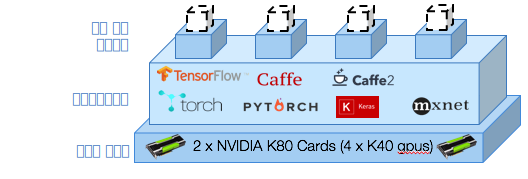

---

copyright:
  years: 2016, 2017
lastupdated: "2017-11-16"

---
{:new_window: target="_blank"}
{:shortdesc: .shortdesc}
{:screen: .screen}
{:codeblock: .codeblock}
{:pre: .pre}

# 소개

<!--  -->

데이터 과학자는 신경망의 성능을 최적화하는 데이터와 초매개변수의 올바른 조합을 식별하기 위해 수백 개의 모델을 훈련시켜야 합니다. 이들은 더 많은 실험을 더 빨리 진행하고자 합니다. 더 깊은 망을 훈련시키고 더 넓은 초매개변수 영역을 탐색하려 합니다. {{site.data.keyword.pm_full}}은 탄력적 GPU 컴퓨팅 클러스터에서 모델을 병렬로 훈련시키도록 프로세스를 단순화하여 이 실험 주기의 진행 속도를 향상시킵니다.
{: shortdesc}

시작하는 방법은 다음과 같습니다. 
1. [{{site.data.keyword.pm_full}}](ml_getting_access.html)을 위한 환경 설정
2. [WML 명령행 인터페이스(CLI) 설치](ml_dlaas_environment.html)
3. 훈련 실행 구성 방법 알아보기
4. 훈련 데이터를 클라우드에 업로드
5. 훈련 시작
6. 모니터링 및 평가

## 각 훈련 실행 구성

{{site.data.keyword.pm_full}}은 훈련을 위해 큐에 삽입할 수 있는 10 - 100회의 훈련 실행을 제출하여 딥 러닝 실험을 신속하게 수행할 수 있게 해 줍니다. 하나의 훈련 실행은 다음 부분으로 구성되어 있습니다.  

* [지원되는 딥 러닝 프레임워크](ml_dlaas_supported_framework.html)에 정의된 신경망 모델 
* GPU의 개수와 [데이터 세트를 포함하는 오브젝트 스토리지](ml_dlaas_object_store.html)를 포함하는, 훈련 실행 방법에 대한 구성

IBM 제공 오브젝트 스토리지에서 호스팅하는 데이터를 포함하는 [훈련 실행 예가 제공됩니다](ml_dlaas_working_with_sample_models.html). 이러한 예의 내용을 읽고 작동하는 manifest.yml의 구성 방법을 이해한 후 여기로 이동하여 [자신의 훈련 실행을 정의하는 방법을 알아보십시오](ml_dlaas_working_with_new_models.html).   

## 훈련 데이터를 클라우드에 업로드

신경망 트레이닝을 시작하기 위해서는 먼저 IBM Cloud로 데이터를 이동해야 합니다. 이를 수행하려면 [오브젝트 스토리지 서비스 인스턴스에 훈련 데이터를 업로드하십시오](ml_dlaas_object_store.html). 훈련이 완료되면, 사용자가 데스크탑으로 파일을 끌어 올 수 있도록 훈련 실행의 출력이 오브젝트 스토리지에 기록됩니다. 

## 훈련 시작

훈련 정의를 작성한 후에는 [명령행 인터페이스(CLI)](ml_dlaas_environment.html)를 사용하여 작업을 {{site.data.keyword.pm_full}}에 제출하십시오. {{site.data.keyword.pm_full}}은 각 훈련 실행을 패키지하고 이를 요청된 리소스 및 딥 러닝 프레임워크와 함께 Kubernetes 컨테이너에 할당합니다. 훈련 실행은 사용자의 계정 레벨에서 사용 가능한 GPU 리소스에 따라 병렬로 실행됩니다. 무료 계정의 경우에는 사용 가능한 GPU가 1개로 제한되므로 모든 추가 실행은 큐에 삽입됩니다. 

앞서 제시된 다이어그램에 표시되어 있는 바와 같이, 4회의 훈련 실행이 4개의 컨테이너에 할당되었습니다. 이러한 각 컨테이너는 훈련에 필요한 딥 러닝 프레임워크를 호스팅하며 하나의 K40 GPU(이 예의 경우)에 액세스할 수 있습니다. 모든 리소스는 탄력적으로 할당되므로 훈련 실행에 GPU가 할당된 후부터 훈련이 완료되고 출력 데이터가 Object Storage 인스턴스에 전송되기까지의 시간에 대해서만 사용자에게 요금이 청구됩니다. 

## 다음 단계

[샘플 훈련 실행](ml_dlaas_working_with_sample_models.html)을 사용하여 작업을 시작하거나 고유한 [새 훈련 실행](ml_dlaas_working_with_new_models.html)을 작성하십시오. 
