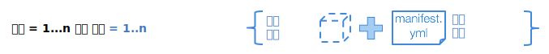

---

copyright:
  years: 2016, 2017
lastupdated: "2017-11-16"

---
{:new_window: target="_blank"}
{:shortdesc: .shortdesc}
{:screen: .screen}
{:codeblock: .codeblock}
{:pre: .pre}

# 훈련 실행 작성

훈련 실행은 {{site.data.keyword.pm_full}}에서 딥 러닝 실험을 수행하는 데 사용되는 조직화 원칙입니다. 일반적인 실험은 수십 회에서 수백 회의 훈련 실행으로 구성됩니다. 각 실행은 개별적으로 정의되며 [지원되는 딥 러닝 프레임워크](ml_dlaas_supported_framework.html)를 사용하여 정의된 신경망, 그리고 훈련을 실행하는 방법(GPU의 개수 및 데이터 세트를 포함하는 오브젝트 스토리지를 포함)에 대한 구성으로 구성됩니다.
{: shortdesc}

<p align="center"></p>

## 모델 정의 .zip 파일 작성

[지원되는 딥 러닝 프레임워크](ml_dlaas_supported_framework.html) 중 하나를 사용하여 신경망 및 연관된 데이터 처리를 정의한 후에는 .zip 형식을 사용하여 이러한 파일을 패키지하십시오. 예를 들어, 모델이 Torch로 작성된 경우에는 .lua 파일로 패키지하고, Caffe로 작성된 경우에는 .prototxt 파일로, TensorFlow/Keras/MXNet으로 작성된 경우에는 .py 파일로 압축하십시오. gzip 또는 tar 등의 다른 압축 형식은 지원되지 않습니다. 모델 정의 파일을 준비하려면 사용할 딥 러닝 프레임워크에 대한 문서를 참조하십시오.   

<!-- Supposedly this isn't true anymore >> NOTE: All model definition files must be in the first level of the zip file so ensure there are no nested directories in the zip file. -->

예를 들어, TensorFlow용 모델 정의를 포함하는 `tf-model.zip` 파일은 다음 출력을 포함할 수 있습니다. 

```
unzip -l tf-model.zip
```
{: codeblock}

샘플 출력:

```
Archive:  tf-model.zip
  Length      Date    Time    Name
---------  ---------- -----   ----
     7094  09-21-2017 11:38   convolutional_network.py
     5486  09-19-2017 13:49   input_data.py
---------                     -------
    12580                     2 files
```
{: codeblock}

## 훈련 데이터 업로드

훈련 데이터는 [호환되는 Object Storage 서비스 인스턴스에 업로드되어야 합니다](ml_dlaas_object_store.html). Object Storage 인스턴스의 신임 정보가 아래 Manifest 파일에 사용됩니다. 이 오브젝트 저장소는 훈련 실행의 끝에 훈련된 모델을 저장하기 위해서도 사용됩니다. 

## 훈련 Manifest 파일 작성

Manifest는 사용할 딥 러닝 프레임워크, Cloud Object Storage 구성, 리소스 요구사항, 훈련 및 테스트 중에 모델 실행에 필요한 몇 가지 인수(초매개변수 포함)를 포함하여 훈련시킬 모델을 나타내는 다양한 필드를 포함하는 YAML 형식의 파일입니다. 아래에는 TensorFlow 필기 인식 예에서 이어지는, 딥 러닝을 위한 모델 훈련 파일의 다양한 필드가 설명되어 있습니다. 

* `model_definition.name`: 사용자는 훈련 작업이 시작된 후 이를 식별하는 데 도움을 주기 위해 이름에 어떤 값이든 제공할 수 있습니다. 그러나 이 값이 고유할 필요는 없습니다. 서비스는 시작된 각 훈련 작업에 대해 고유 모델 ID를 지정합니다. 
* `model_definition.description`: 이는 작업을 설명하는 데 사용할 수 있는 또 다른 필드입니다. 
* `model_definition.author`: 선택사항입니다. 키 *name* 및 *email* 아래에 작성자 이름 및 이메일 주소를 제공하십시오. 
* `model_definition.framework`: 이 필드는 이름 및 버전이 [지원되는 딥 러닝 프레임워크](ml_dlaas_supported_framework.html) 중 하나와 일치해야 하는 프레임워크 고유 정보를 제공합니다. 
    - `model_definition.framework.name`: 프레임워크의 이름입니다. 
    - `model_definition.framework.version`: 프레임워크의 버전입니다. 
* `model_definition.execution`: 이 필드는 훈련을 시작하는 명령에 대한 정보를 제공합니다. 
    - `model_definition.execution.command`: 이 필드는 기본 프로그램 파일과 딥 러닝이 실행해야 하는 인수를 식별합니다. 
    - `model_definition.execution.resource`: 이 필드는 훈련을 위해 할당될 리소스를 지정하며 값은 `small`(1개 GPU), `medium`(2개 GPU), `large`(4개 GPU) 중 하나여야 합니다. 
* `training_data_reference`: 이 섹션은 모델을 훈련시키는 데 사용되는 데이터 파일이 로드되는 오브젝트 저장소의 목록을 지정합니다. 현재 이 목록은 다음 정의를 사용하여 하나의 오브젝트 저장소만을 포함해야 합니다. 
    - `connection`: 데이터 저장소에 대한 연결 변수입니다. 
    - `source.type`: 데이터 저장소의 유형으로, 현재는 s3 또는 bluemix_objectstore로만 설정할 수 있습니다. Object Storage 인스턴스가 *Cloud Object Storage(IaaS)*인 경우에는 `s3`, *Bluemix용 Object Storage OpenStack Swift*인 경우에는 `bluemix_objectstore`를 사용하십시오. 
    - `source.bucket`: 훈련 데이터가 있는 버킷입니다. 
* `training_results_reference`: 이 섹션은 훈련이 완료된 후 결과 모델 파일 및 로그가 저장될 오브젝트 저장소를 지정합니다. 
    - `connection`: 데이터 저장소에 대한 연결 변수입니다. 지원되는 연결 변수의 목록은 데이터 저장소 유형에 따라 달라집니다. 
    - `target.type`: 데이터 저장소의 유형으로, 현재는 s3 또는 bluemix_objectstore로만 설정할 수 있습니다. Object Storage 인스턴스가 *Cloud Object Storage(IaaS)*인 경우에는 `s3`, *Bluemix용 Object Storage OpenStack Swift*인 경우에는 `bluemix_objectstore`를 사용하십시오. 
    - `target.bucket`: 훈련 데이터가 기록될 버킷입니다. 

예를 들어, 다음 모델 훈련 정의 파일은 TensorFlow 모델을 훈련시키는 작업을 정의하는 데 사용할 수 있습니다. 

```
model_definition:
  framework:
    name: tensorflow
    version: 1.2-py3
  name: tf-mnist-showtest1
  author:
    name: WML User
    email: wmluser@ibm.com
  description: Simple MNIST model implemented in TF
  execution:
    command: python3 convolutional_network.py --trainImagesFile ${DATA_DIR}/train-images-idx3-ubyte.gz
      --trainLabelsFile ${DATA_DIR}/train-labels-idx1-ubyte.gz --testImagesFile ${DATA_DIR}/t10k-images-idx3-ubyte.gz
      --testLabelsFile ${DATA_DIR}/t10k-labels-idx1-ubyte.gz --learningRate 0.001
      --trainingIters 2000000
    resource: small
training_data:
- connection:
    endpoint_url: <auth-url>
    aws_access_key_id: <username>
    aws_secret_access_key: <password>
  source:
    bucket: mnist-training-data
    type: s3
training_results:
  connection:
    endpoint_url: <auth-url>
    aws_access_key_id: <username>
    aws_secret_access_key: <password>
  target:
    bucket: mnist-training-models
    type: s3
```
{: codeblock]

여기서 `convolutional_network.py`는 실행할 TensorFlow 프로그램(모델 정의 zip의 일부)이며 나머지는 프로그램에 대한 인수입니다. 프로그램 인수 `--trainImagesFile train-images-idx3-ubyte.gz`, `--trainLabelsFile train-labels-idx1-ubyte.gz`, `--testImagesFile t10k-images-idx3-ubyte.gz`, `--testLabelsFile t10k-labels-idx1-ubyte.gz` 값은 오브젝트 저장소 컨테이너 `tf_training_data`의 데이터 세트 경로를 참조합니다. 프로그램 인수 `--trainingIters 20000` 및 `--learningRate 0.001`은 초매개변수의 값을 전달합니다. 

**참고**: 훈련 구성 또는 모델 정의 파일이 Object Storage 인스턴스에 업로드된 파일을 참조하는 경우 이러한 참조는 위에 표시되어 있는 바와 같이 상대 경로를 사용해야 합니다. 

**참고**: 훈련이 시작되기 전에, 훈련 데이터 버킷의 모든 파일은 서비스에서 운영하는 훈련 환경으로 다운로드됩니다. 불필요한 파일 전송으로 인해 오버헤드/지연 시간이 발생하는 것을 방지하려면 훈련 파일에 사용되지 않는 파일을 별도의 버킷에 보관하십시오. 

**참고**: 위 예에서 데이터를 제공하고 결과 모델을 저장하는 데 사용되는 오브젝트 저장소는 *Cloud Object Storage(IaaS)*입니다. 사용되는 오브젝트 저장소가 *Object Storage Open Stack Swift for Bluemix*인 경우에는 연결 키가 다르며, 이에 대한 Manifest 예는 아래에 제공되어 있습니다. 

```
model_definition:
  framework:
    name: tensorflow
    version: 1.2-py3
  name: tf-mnist-showtest1
  author:
    name: WML User
    email: wmluser@ibm.com
  description: Simple MNIST model implemented in TF
  execution:
    command: python3 convolutional_network.py --trainImagesFile ${DATA_DIR}/train-images-idx3-ubyte.gz
      --trainLabelsFile ${DATA_DIR}/train-labels-idx1-ubyte.gz --testImagesFile ${DATA_DIR}/t10k-images-idx3-ubyte.gz
      --testLabelsFile ${DATA_DIR}/t10k-labels-idx1-ubyte.gz --learningRate 0.001
      --trainingIters 2000000
    resource: small
training_data_reference:
- connection:
    auth_url: <auth-url>
    user_name: <username>
    password: <password>
    region: <region>
    domain_name: <domain-name>
    project_id: <project-id>
  source:
    bucket: mnist-training-data
    type: bluemix_objectstore
training_results_reference:
  connection:
    auth_url: <auth-url>
    user_name: <username>
    password: <password>
    region: <region>
    domain_name: <domain-name>
    project_id: <project-id>
  target:
    bucket: mnist-training-models
    type: bluemix_objectstore
```
{: codeblock]

**참고** *Object Storage Open Stack Swift for Bluemix* 연결의 경우, Object Store 신임 정보의 키 이름과 Manifest에서 필요한 키 이름 간의 맵핑은 다음과 같습니다. 

| {{site.data.keyword.Bluemix_notm}} 신임 정보 키  | 훈련 Manifest 신임 정보 키 |
|----------------------------------------------------|----------------------------------------|
|auth_url |auth_url |
|username |user_name |
|비밀번호|비밀번호|
|projectId |project_id |
|region |region |
|domainName |domain_name |
{: caption="표 1. {{site.data.keyword.Bluemix_notm}} 및 훈련 Manifest 신임 정보 키" caption-side="top"}

## 훈련 실행 제출

모델 정의 .zip 및 훈련 구성 파일을 준비한 후에는 다음과 같이 `bx ml train` 명령을 사용하여 작업을 제출하십시오: `bx ml train <path-to-model-definition-zip> <path-to-model-configuration-yaml>` 

```
bx ml train tf-model.zip job.yaml
```
{: codeblock}

샘플 출력:

명령이 제출되면 고유 모델 ID가 리턴됩니다. 예를 들어, 다음 출력은 `training-DOl4q2LkR`이라는 `Model-ID` 값을 보여줍니다. 

```
Starting to train ...
OK
Model-ID is 'training-DOl4q2LkR'
```

# 훈련 실행 모니터링

모든 훈련 작업(완료 여부와 관계 없이)을 나열하려면 CLI 명령 `bx ml list trained-models`를 사용하십시오. 

```
bx ml list trained-models
```
{: codeblock}

샘플 출력:

```
Fetching the list of trained models ...
SI No   Name                       guid                 status    submitted-at
1       tf-mnist                   training-DOl4q2LkR   pending   2017-10-26T11:16:51Z

1 records found.
OK
List all trained-models successful
```
{: codeblock}

**참고**: 이 서비스는 훈련 작업의 세부사항을 7일 동안만 보존하며 그 이후에는 해당 세부사항이 목록에서 제거되어 더 이상 표시되지 않습니다. 

특정 작업을 모니터하려면 CLI 명령 `bx ml show trained-models <model-id>`를 사용하십시오. 

```
bx ml show trained-models training-DOl4q2LkR
```
{: codeblock}

샘플 출력:

```
Fetching the trained model details with MODEL-ID 'training-DOl4q2LkR' ...
ModelId        training-DOl4q2LkR
url            /v3/models/training-DOl4q2LkR
Name           tf-mnist
State          running
Submitted_at   2017-10-26T11:10:37Z
OK
Show trained-models details successful
```
{: codeblock}

**참고**: 현재 show CLI 명령 출력에서 실패한 작업이 삭제된 것처럼 사라지는 알려진 문제가 있습니다. 이 문제는 곧 정정될 예정이지만, 그 전까지는 훈련 작업이 사라지는 현상이 보이면 아래에 설명되어 있는 바와 같이 훈련 로그 파일을 확인하여 작업이 실패한 이유를 찾으십시오. 

작업이 완료되면(또는 실패하면) 훈련된 모델 파일 및 로그는 모델 훈련 정의 파일의 설정 `training_results_reference`에 지정된 Cloud Object Storage 버킷의, 모델 ID와 동일한 이름의 폴더에 기록됩니다. 

## 훈련 실행 삭제

훈련 작업을 삭제(이는 Object Storage 인스턴스에 출력된 훈련된 모델 및 로그를 제거하지 않으나, 서비스에서 훈련 작업의 모든 히스토리를 제거함)하려면 다음 명령을 실행하십시오. 

```
bx ml delete trained-models training-DOl4q2LkR
```
{: codeblock}


샘플 출력:

```
Deleting the trained model 'training-DOl4q2LkR' ...
OK
Delete trained-models successful
```
{: codeblock}
