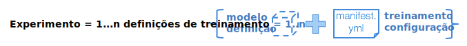
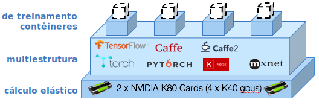

---

copyright: years: 2016, 2017 lastupdated: "2017-11-16"

---
{:new_window: target="_blank"}
{:shortdesc: .shortdesc}
{:screen: .screen}
{:codeblock: .codeblock}
{:pre: .pre}

# Introdução

<!--  -->

Como cientista de dados, você precisa treinar centenas de modelos para
identificar a combinação certa de dados mais hiperparâmetros que otimize o desempenho de
suas redes neurais. Você deseja fazer mais experimentos ... e mais rápido. Você quer
treinar redes mais profundas e explorar espaços mais amplos de hiperparâmetros. O
{{site.data.keyword.pm_full}} acelera esse ciclo experimental, simplificando o
processo para treinar modelos em paralelo em um cluster de cálculo de GPU elástico.
{: shortdesc}

Veja como começar:
1. [Configure seu ambiente para o {{site.data.keyword.pm_full}}](ml_getting_access.html)
2. [Instale a interface da linha de comandos (CLI) WML](ml_dlaas_environment.html)
3. Aprenda a configurar a execução do seu treinamento
4. Faça upload dos dados de treinamento para a nuvem
5. Iniciar treinamento
6. Monitore e avalie

## Configure cada execução de treinamento

O {{site.data.keyword.pm_full}} permite que você conduza rapidamente
experimentos de aprendizado profundo enviando de 10 a 100 execuções de treinamento que
podem ser enfileiradas para treinamento. Uma execução de treinamento consiste nas partes
a seguir: 

* Seu modelo de rede neural definido na [estrutura de aprendizado profundo suportada](ml_dlaas_supported_framework.html) 
* A configuração de como executar seu treinamento, que inclui o número de GPUs e o local do [armazenamento de objeto que contém seu conjunto de dados](ml_dlaas_object_store.html)

[São fornecidas execuções de
treinamento de exemplo](ml_dlaas_working_with_sample_models.html) que incluem dados hospedados em um armazenamento de objeto fornecido
pela IBM. Leia esses exemplos para entender como os manifest.yml de trabalho são configurados; em seguida, venha aqui para [aprender a definir suas próprias execuções de treinamento](ml_dlaas_working_with_new_models.html).  

## Faça upload dos dados de treinamento para a nuvem

Para poder iniciar o treinamento de suas redes neurais, primeiro você precisa mover
seus dados para o IBM Cloud. Para fazer isso,
[faça upload dos seus dados de treinamento para
uma instância de serviço de armazenamento de objeto](ml_dlaas_object_store.html). Quando concluir o treinamento, o resultado das suas execuções de treinamento será gravado em seu armazenamento de objeto para que você possa arrastar arquivos para sua área de trabalho.

## Iniciar treinamento

Depois de criar suas definições de treinamento, use a
[CLI (Interface da Linha de Comandos)](ml_dlaas_environment.html) para
enviar suas tarefas para o {{site.data.keyword.pm_full}}. O
{{site.data.keyword.pm_full}} empacota cada uma de suas execuções de treinamento
e as aloca para um contêiner do Kubernetes com os recursos solicitados e a estrutura de
aprendizado profundo. As execuções de treinamento ocorrem em paralelo dependendo dos
recursos de GPU disponíveis para seu nível de conta. Para contas grátis, o limite é de 1
GPU, de modo que todas as execuções adicionais são enfileiradas.

Conforme indicado no diagrama anterior, 4 execuções de treinamento são alocadas para 4 contêineres. Cada
um desses contêineres hospeda a estrutura de aprendizado profundo requerida pela
execução de treinamento e tem acesso a um único GPU K40 (neste exemplo). Todos os
recursos são alocados elasticamente; assim, você é cobrado somente a partir do momento em
que sua execução de treinamento recebe um GPU até o treinamento ser concluído e os dados
de saída serem transferidos para sua instância de armazenamento de objeto.

## Próximas Etapas

Comece a usar essas [execuções de treinamento de amostra](ml_dlaas_working_with_sample_models.html) ou crie suas próprias [novas execuções de treinamento](ml_dlaas_working_with_new_models.html).
