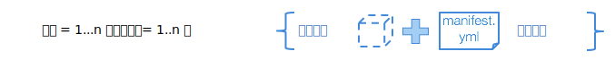
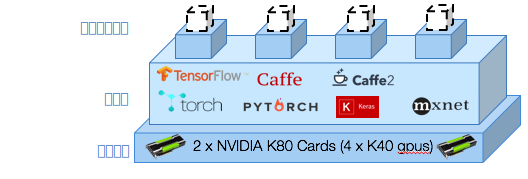

---

copyright:
  years: 2016, 2017
lastupdated: "2017-11-16"

---
{:new_window: target="_blank"}
{:shortdesc: .shortdesc}
{:screen: .screen}
{:codeblock: .codeblock}
{:pre: .pre}

# 简介

<!--  -->

作为数据研究员，您需要培训数百个模型，才能确定正确的数据组合以及可优化神经网络性能的超参数。您会希望更多...更快地执行试验。同时希望培训更深的网络并探索更广泛的超参数空间。{{site.data.keyword.pm_full}} 通过简化流程，在弹性 GPU 计算集群上并行培训模型，从而缩短了这一试验周期。
{: shortdesc}

下面是入门方法：
1. [为 {{site.data.keyword.pm_full}} 设置环境](ml_getting_access.html)
2. [安装 WML 命令行界面 (CLI)](ml_dlaas_environment.html)
3. 了解如何配置培训运行
4. 将培训数据上传到云
5. 开始培训
6. 监视和评估

## 配置各个培训运行

{{site.data.keyword.pm_full}} 支持通过提交 10 到 100 个可排队等待培训的培训运行，快速执行深度学习试验。培训运行由以下部分组成： 

* 在[支持的深度学习框架](ml_dlaas_supported_framework.html)中定义的神经网络模型 
* 用于设置培训运行方式的配置，包括 GPU 数和[包含数据集的 Object Storage](ml_dlaas_object_store.html) 的位置

提供了[示例培训运行](ml_dlaas_working_with_sample_models.html)，这些运行包含在 IBM 提供的 Object Storage 上托管的数据。阅读这些示例可了解如何配置工作 manifest.yml，然后转至[了解如何定义自己的培训运行](ml_dlaas_working_with_new_models.html)。  

## 将培训数据上传到云

在开始培训神经网络之前，首先需要将数据移入 IBM Cloud。为此，请[将培训数据上传到 Object Storage 服务实例](ml_dlaas_object_store.html)。完成培训后，培训运行的输出会写入 Object Storage，以便可以将文件拖至桌面。

## 开始培训

创建培训定义后，请使用 [CLI（命令行界面）](ml_dlaas_environment.html)将作业提交给 {{site.data.keyword.pm_full}}。{{site.data.keyword.pm_full}} 会对每个培训运行打包，并将其分配给具有所请求资源和深度学习框架的 Kubernetes 容器。培训运行会根据可用于您帐户级别的 GPU 资源来并行执行。对于免费帐户，您只能使用 1 个 GPU，因此其他所有运行都会排队。

如上图所示，4 个培训运行分别分配给了 4 个容器。其中每个容器托管相应培训运行所需的深度学习框架，并有权访问单个 K40 GPU（在本例中）。所有资源会以弹性方式进行分配，这样就只会向您收取从为培训运行分配 GPU 时开始一直到培训完成这段时间的费用，并且输出数据会传输到您的 Object Storage 实例。

## 后续步骤

开始使用这些[样本培训运行](ml_dlaas_working_with_sample_models.html)，或者创建您自己的[新的培训运行](ml_dlaas_working_with_new_models.html)。
