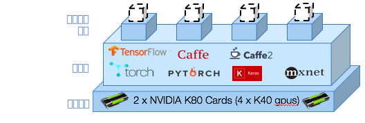

---

copyright:
  years: 2016, 2017
lastupdated: "2017-11-16"

---
{:new_window: target="_blank"}
{:shortdesc: .shortdesc}
{:screen: .screen}
{:codeblock: .codeblock}
{:pre: .pre}

# 簡介

<!--  -->

身為資料科學家，您需要訓練數百個模型，以識別正確的資料與超參數組合，以最佳化類神經網路的效能。您想要更快速地執行更多實驗。您想要訓練更深層的網路，並探索更廣泛的超參數空間。{{site.data.keyword.pm_full}} 可加速此實驗性週期，方法是簡化在彈性 GPU 運算叢集上平行訓練模型的程序。
{: shortdesc}

以下是開始使用的方式：
1. [設定 {{site.data.keyword.pm_full}} 的環境](ml_getting_access.html)
2. [安裝 WML 指令行介面 (CLI)](ml_dlaas_environment.html)
3. 學習如何配置訓練執行
4. 將訓練資料上傳至雲端
5. 開始訓練
6. 監視及評估

## 配置每一次訓練執行

{{site.data.keyword.pm_full}} 可讓您提交可置入佇列以進行訓練的 10-100 次訓練執行，以快速處理深度學習實驗。訓練執行包含下列部分： 

* [支援的深度學習架構](ml_dlaas_supported_framework.html)中所定義的類神經網路模型 
* 如何執行訓練的配置，包括 GPU 數目以及[包含資料集的物件儲存空間](ml_dlaas_object_store.html)的位置

[提供範例訓練執行](ml_dlaas_working_with_sample_models.html)，其中包括 IBM 所提供物件儲存空間上所管理的資料。請閱讀這些範例以瞭解如何配置運作中的 manifest.yml，然後移至[學習如何定義自己的訓練執行](ml_dlaas_working_with_new_models.html)。  

## 將訓練資料上傳至雲端

您需要先將資料移至 IBM Cloud，才能開始訓練您的類神經網路。若要這麼做，請[將訓練資料上傳至物件儲存空間服務實例](ml_dlaas_object_store.html)。完成訓練時，會將訓練執行的輸出寫入至物件儲存空間，以讓您將檔案拖曳至桌面。

## 開始訓練

建立訓練定義之後，請使用 [CLI（指令行介面）](ml_dlaas_environment.html)，將工作提交至 {{site.data.keyword.pm_full}}。{{site.data.keyword.pm_full}} 會包裝每一個訓練執行，並將它們配置給具有所要求資源及深度學習架構的 Kubernetes 容器。根據您帳戶層次可用的 GPU 資源，平行執行訓練執行。對於免費帳戶，您只能使用 1 個 GPU，因此會將所有其他執行置入佇列。

如上圖所示，將 4 個訓練執行配置給 4 個容器。其中每一個容器都會管理訓練執行所需的深度學習架構，而且可以存取單一 K40 GPU（在此實例中）。所有資源都已彈性配置，因此只有在您的訓練執行獲指派 GPU 之後才會向您收費，直到訓練完成並將輸出資料傳送至 Object Storage 實例為止。

## 後續步驟

開始使用這些[範例訓練執行](ml_dlaas_working_with_sample_models.html)，或建立自己的[新訓練執行](ml_dlaas_working_with_new_models.html)。
