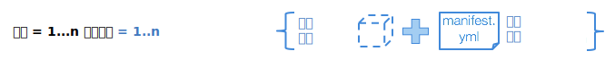

---

copyright:
  years: 2016, 2017
lastupdated: "2017-11-16"

---
{:new_window: target="_blank"}
{:shortdesc: .shortdesc}
{:screen: .screen}
{:codeblock: .codeblock}
{:pre: .pre}

# 建立訓練執行

訓練執行是處理 {{site.data.keyword.pm_full}} 中深度學習實驗的組織原則。一般實驗可能是由數十到數百項訓練執行所組成。每一個執行都是個別定義的，並由下列部分組成：使用其中一個[支援的深度學習架構](ml_dlaas_supported_framework.html)所定義的類神經網路，以及如何執行訓練的配置，包括 GPU 數目以及包含資料集的物件儲存空間的位置。
{: shortdesc}

<p align="center"></p>

## 建立模型定義 .zip 檔案

在使用其中一個[支援的深度學習架構](ml_dlaas_supported_framework.html)來定義類神經網路及關聯的資料處理之後，請使用 .zip 格式將這些檔案包裝在一起。例如，如果是以 Torch 撰寫模型，則請包裝 .lua 檔案；如果是以 Caffe，則請壓縮 .prototxt 檔案；或者，如果是以 Tensorflow/Keras/MXNet，則請壓縮 .py 檔案。不支援其他壓縮格式，例如 gzip 或 tar。請參閱您要使用的「深度學習」架構文件，以準備模型定義檔。  

<!-- Supposedly this isn't true anymore >> NOTE: All model definition files must be in the first level of the zip file so ensure there are no nested directories in the zip file. -->

例如，包含 tensorflow 模型定義的 zip 檔案 `tf-model.zip` 可能包含下列輸出：

```
unzip -l tf-model.zip
```
{: codeblock}

輸出範例：

```
Archive:  tf-model.zip
  Length      Date    Time    Name
---------  ---------- -----   ----
     7094  09-21-2017 11:38   convolutional_network.py
     5486  09-19-2017 13:49   input_data.py
---------                     -------
    12580                     2 files
```
{: codeblock}

## 上傳訓練資料

您的訓練資料必須[上傳至相容的 Object Storage 服務實例](ml_dlaas_object_store.html)。來自該 Object Storage 實例的認證將會用在下面的資訊清單檔中。在訓練執行結束時，也會使用物件儲存庫來儲存訓練模型。

## 建立訓練資訊清單檔

資訊清單是一個 YAML 格式檔案，其包含幾個不同欄位以說明要訓練的模型，而這些模型包括要使用的深度學習架構、雲端物件儲存空間配置、資源需求，以及在訓練及測試期間執行模型所需的數個引數（包括超參數）。在下面，我們說明模型訓練檔案的不同欄位，以進行深度學習、持續 tensorflow 手寫辨識範例。

* `model_definition.name`：訓練工作啟動之後，您可以提供任何 name 值來協助識別該訓練工作。不過，這不需要是唯一的；服務將會為每一個已啟動的訓練工作指派唯一模型 ID。
* `model_definition.description`：這是另一個可用來說明工作的欄位。
* `model_definition.author`：選用。在索引鍵 *name* 及 *email* 下，提供作者名稱及電子郵件位址。
* `model_definition.framework`：此欄位提供架構特定資訊，而名稱及版本必須符合其中一個[支援的深度學習架構](ml_dlaas_supported_framework.html)。
    - `model_definition.framework.name`：架構的名稱
    - `model_definition.framework.version`：架構的版本。
* `model_definition.execution`：此欄位提供訓練啟動指令的相關資訊。
    - `model_definition.execution.command`：此欄位識別主程式檔案，以及深度學習需要執行的任何引數。
    - `model_definition.execution.resource`：此欄位指定將配置以進行訓練的資源，而且應該是下列其中一個值：`small`（1 個 GPU）、`medium`（2 個 GPU）、`large`（4 個 GPU）
* `training_data_reference`：此區段指定從中載入用來訓練模型的資料檔案的物件儲存庫清單。此清單目前應只包含一個物件儲存庫，以及下列定義：
    - `connection`：資料儲存庫的連線變數。
    - `source.type`：資料儲存庫的類型，這目前只能設為 s3 或 bluemix_objectstore。如果您的 Object Storage 實例是 *Cloud Object Storage (IaaS)*，請使用 `s3`，如果您的 Object Storage 實例是 *Object Storage OpenStack Swift for Bluemix*，則請使用 `bluemix_objectstore`。
    - `source.bucket`：訓練資料所在的儲存區。
* `training_results_reference`：此區段指定訓練完成之後將在其中儲存所產生模型檔及日誌的物件儲存庫。
    - `connection`：資料儲存庫的連線變數。支援的連線變數清單是資料儲存庫類型相依。
    - `target.type`：資料儲存庫的類型，這目前只能設為 s3 或 bluemix_objectstore。如果您的 Object Storage 實例是 *Cloud Object Storage (IaaS)*，請使用 `s3`，如果您的 Object Storage 實例是 *Object Storage OpenStack Swift for Bluemix*，則請使用 `bluemix_objectstore`。
    - `target.bucket`：寫入訓練結果的儲存區。

例如，下列模型訓練定義檔可以用來定義工作，以訓練 tensorflow 模型：

```
model_definition:
  framework:
    name: tensorflow
    version: 1.2-py3
  name: tf-mnist-showtest1
  author:
    name: WML User
    email: wmluser@ibm.com
  description: Simple MNIST model implemented in TF
  execution:
    command: python3 convolutional_network.py --trainImagesFile ${DATA_DIR}/train-images-idx3-ubyte.gz
      --trainLabelsFile ${DATA_DIR}/train-labels-idx1-ubyte.gz --testImagesFile ${DATA_DIR}/t10k-images-idx3-ubyte.gz
      --testLabelsFile ${DATA_DIR}/t10k-labels-idx1-ubyte.gz --learningRate 0.001
      --trainingIters 2000000
    resource: small
training_data:
- connection:
    endpoint_url: <auth-url>
    aws_access_key_id: <username>
    aws_secret_access_key: <password>
  source:
    bucket: mnist-training-data
    type: s3
training_results:
  connection:
    endpoint_url: <auth-url>
    aws_access_key_id: <username>
    aws_secret_access_key: <password>
  target:
    bucket: mnist-training-models
    type: s3
```
{: codeblock]

其中 `convolutional_network.py` 是要執行的 tensorflow 程式（這是模型定義 zip 的一部分），而其他部分則是程式的引數。程式引數 `--trainImagesFile train-images-idx3-ubyte.gz`、`--trainLabelsFile train-labels-idx1-ubyte.gz`、`--testImagesFile t10k-images-idx3-ubyte.gz`、`--testLabelsFile t10k-labels-idx1-ubyte.gz` 值會參照物件儲存庫容器 `tf_training_data` 中的資料集路徑。程式引數 `--trainingIters 20000` 及 `--learningRate 0.001` 會傳遞超參數的值。

**附註**：訓練配置或模型定義檔參照上傳至 Object Storage 實例的檔案時，參照應使用相對路徑，如上所示。

**附註**：在訓練開始之前，訓練資料儲存區內的所有檔案都會下載至服務所操作的訓練環境。若要避免超載/延遲傳送不必要的檔案，請將未用於訓練檔案的檔案保留在個別儲存區中。

**附註**：在上述範例中，用來提供資料及儲存所產生模型的物件儲存庫是 *Cloud Object Storage (IaaS)*。另一方面，如果所使用的物件儲存庫是 *Object Storage Open Stack Swift for Bluemix*，則連線金鑰會不同，範例資訊清單如下：

```
model_definition:
  framework:
    name: tensorflow
    version: 1.2-py3
  name: tf-mnist-showtest1
  author:
    name: WML User
    email: wmluser@ibm.com
  description: Simple MNIST model implemented in TF
  execution:
    command: python3 convolutional_network.py --trainImagesFile ${DATA_DIR}/train-images-idx3-ubyte.gz
      --trainLabelsFile ${DATA_DIR}/train-labels-idx1-ubyte.gz --testImagesFile ${DATA_DIR}/t10k-images-idx3-ubyte.gz
      --testLabelsFile ${DATA_DIR}/t10k-labels-idx1-ubyte.gz --learningRate 0.001
      --trainingIters 2000000
    resource: small
training_data_reference:
- connection:
    auth_url: <auth-url>
    user_name: <username>
    password: <password>
    region: <region>
    domain_name: <domain-name>
    project_id: <project-id>
  source:
    bucket: mnist-training-data
    type: bluemix_objectstore
training_results_reference:
  connection:
    auth_url: <auth-url>
    user_name: <username>
    password: <password>
    region: <region>
    domain_name: <domain-name>
    project_id: <project-id>
  target:
    bucket: mnist-training-models
    type: bluemix_objectstore
```
{: codeblock]

**附註**：對於 *Object Storage Open Stack Swift for Bluemix* 連線，「物件儲存庫」認證中的金鑰名稱與資訊清單中所需的金鑰名稱之間的對映：

| {{site.data.keyword.Bluemix_notm}} 認證金鑰  | 訓練資訊清單認證金鑰|
|----------------------------------------------------|----------------------------------------|
|auth_url |auth_url |
|username |user_name |
|password |password |
|projectId |project_id |
|region |region |
|domainName |domain_name |
{: caption="表 1. {{site.data.keyword.Bluemix_notm}} 及訓練資訊清單認證金鑰" caption-side="top"}

## 提交訓練執行

在您準備模型定義 .zip 及訓練配置檔之後，請使用 `bx ml train` 指令來提交工作：`bx ml train <path-to-model-definition-zip> <path-to-model-configuration-yaml>` 

```
bx ml train tf-model.zip job.yaml
```
{: codeblock}

輸出範例：

順利提交此指令時，會傳回唯一模型 ID。例如，下列輸出顯示 `training-DOl4q2LkR` 的 `Model-ID` 值：

```
Starting to train ...
OK
Model-ID is 'training-DOl4q2LkR'
```

# 監視訓練執行

若要列出所有訓練工作（不論是否已完成），請使用 CLI 指令 `bx ml list trained-models`

```
bx ml list trained-models
```
{: codeblock}

輸出範例：

```
Fetching the list of trained models ...
SI No   Name                       guid                 status    submitted-at
1       tf-mnist                   training-DOl4q2LkR   pending   2017-10-26T11:16:51Z

1 records found.
OK
List all trained-models successful
```
{: codeblock}

**附註**：服務只會保留訓練工作的詳細資料 7 天，在此時間之後，即會移除它們，而且不會出現在清單中。

若要監視特定工作，請使用 CLI 指令 `bx ml show trained-models <model-id>`：

```
bx ml show trained-models training-DOl4q2LkR
```
{: codeblock}

輸出範例：

```
Fetching the trained model details with MODEL-ID 'training-DOl4q2LkR' ...
ModelId        training-DOl4q2LkR
url            /v3/models/training-DOl4q2LkR
Name           tf-mnist
State          running
Submitted_at   2017-10-26T11:10:37Z
OK
Show trained-models details successful
```
{: codeblock}

**附註**：目前的已知問題是失敗工作會從清單中消失並顯示 CLI 指令輸出，就像此工作已被刪除一樣。將會更正此問題，但同時，如果您看到訓練工作消失，請檢查下面所說明的訓練日誌檔，以找出工作失敗的原因。

工作順利完成（或失敗）時，應會將訓練模型檔及日誌寫入模型訓練定義檔內設定 `training_results_reference` 中所指定的 Cloud Object Storage 儲存區，而此定義檔位在名稱與模型 ID 相同的資料夾下。

## 刪除訓練執行

刪除訓練工作（這不會移除已輸出至 Object Storage 實例的訓練模型及日誌，而是會從服務中移除訓練工作的所有歷程）。

```
bx ml delete trained-models training-DOl4q2LkR
```
{: codeblock}


輸出範例：

```
Deleting the trained model 'training-DOl4q2LkR' ...
OK
Delete trained-models successful
```
{: codeblock}
